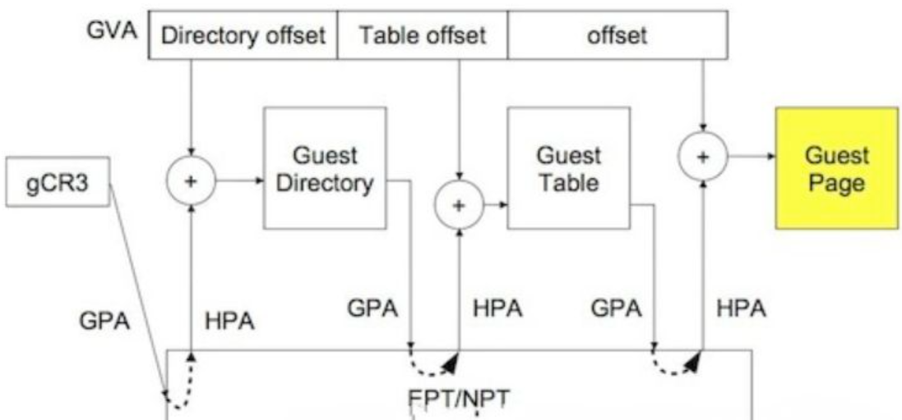
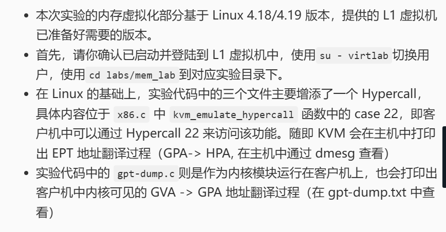
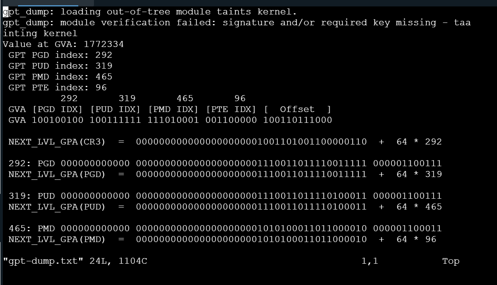
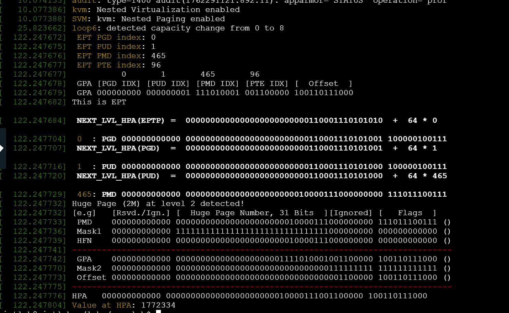

# 实验一: 内存虚拟化

[523031910774] [徐世奇]

## 1 调研部分

##### 1.主机的虚拟内存是如何通过页表实现的？（参考书籍的 3.2.1 节）


---- 操作系统将虚拟地址空间和物理地址空间都划分为固定大小的块（通常是 4KB），分别称为虚拟页和物理帧。使用存储虚拟页号到对应物理帧号的映射关系，并包含权限位、有效位等控制信息，当 CPU 访问一个虚拟地址时，内存管理单元会提取虚拟页号，获取对应的物理帧号物理帧号与原地址的页内偏移量拼接，形成最终的物理地址。
---- 为了提高转换速度，CPU 内部设有高速缓存 TLB来缓存最近的映射关系，避免频繁访问内存中的页表。


##### 2.请画出 EPT 地址翻译过程的示意图（参考书籍的 3.2.3 节）
客户机物理地址（GPA）到主机物理地址（HPA）的转换，客户机执行内存访问指令，生成虚拟地址（GVA），通过客户机自身页表，将 GVA 转换为GPA，CPU 检测到虚拟化模式且 EPT 开启，触发 EPT 转换流程，CPU 过 EPT 指针找到根 EPT 页表，依次遍历 EPT 页表各级，将 GPA 映为 HPA，CPU 使用最终的 HPA 访问主机物理内存，完成指令执行。


##### 3.请根据你的理解解释 QEMU是如何通过 KVM 接口建立 EPT 的（参考书籍的第三章图 3-12 ）
QEMU 在用户空间中分配一大块内存作为客户机物理内存，并知道这块内存对应的宿主机虚拟地址，QEMU 通过 KVM API，将GPA及其对应的HVA信息提交给 KVM 内核模块，KVM 构建 EPT，KVM 接收信息后，在内核中将 HVA 转换为宿主机物理地址，并据此构建EPT结构（即GPA $\rightarrow$ HPA 的映射表）。
KVM 将 EPT 根指针加载到 CPU 的 VMCS 结构中，开启硬件辅助。此后，CPU 在内存访问时会自动通过EPT进行GPA $\rightarrow$ HPA的双重地址转换。


## 2 实验目的
......1.（这一步较为复杂，助教已在提供的 L1 虚拟机中做完了。同学如有兴趣，可自行尝试）下载 Linux 4.18/4.19 版本内核，将 arch/x86/kvm 下的 x86.c mmu.h mmu.c 三个文件替换为仓库第三章目录下的相应文件，编译并替换内核。
......2.在客户机中下载 实验代码，进入 “第3章” 目录下，使用 make 编译内核模块并运行，观察运行结果
## 3 实验步骤

按照题目要求启动L2客户机
```
# 请确认，你当前正处于 L1 虚拟机的命令行中
# 启动 qemu，如果使用的是配置完成的虚拟机镜像则直接切换到相应目录下用 sudo 权限运行 start.sh 即可
sudo qemu-system-x86_64 --enable-kvm -m 2G -net nic \
    -net user,hostfwd=tcp::2222-:22 \
    -drive file=./ubuntu18.qcow2,if=virtio \
    -drive file=seed.iso,if=virtio \
    -nographic
# 连接 L2 客户机，使用 nographic 模式直接会进入 L2 虚拟机的登录页面
# 客户机账号: ubuntu  密码： Virtlabs （注意 V 字母是大写，注意最后有个小写的 s ）
# 启动后，你当前应正处于 L2 虚拟机的命令行中
```
在L2客户机中保存了gpt-dump.txt内容，随后退出进入L1虚拟机观察翻译过程，然后完成整个实验部分。
```
# 请确认，你当前正处于 L2 虚拟机的命令行中
# 由于网页终端中文显示有乱码，将 第3章 改为 Chapter3，请同学留意
# 到实验代码 Chapter3 目录下
cd ~/Book/Chapter3
make
# gpt-dump.ko should be here
sudo ./run.sh
# 虚拟机内核中的页表翻译过程会保存在 gpt-dump.txt 中
# 应在此处保存 gpt-dump.txt 中的内容，为客户机页表的翻译过程
# 回到 L1 虚拟机中：
sudo poweroff
# 请确认，你当前正处于 L1 虚拟机的命令行中 (用户名为 virtlab)
# 在 L1 虚拟机中运行以下命令，应该可以看到 GPA 到 HPA 的 EPT 翻译过程
sudo dmesg
```


## 4 实验分析
实验主要实现了一个内存地址从客户机虚拟地址 (GVA)经过两级转换到达宿主机物理地址 (HPA)的完整过程。


**第一阶段：客户机地址翻译 (GVA $\rightarrow$ GPA)**
在L2里面实现，目标 GVA 的地址被分解为用于四级页表查询的索引和最终的页内偏移。
根据 `gpt-dump.txt` 的记录，这个 GVA 的各级页表索引和页内偏移（二进制表示）如下：
PGD：`100100100` (292)
PUD：`100111111` (319)
PMD：`111010001` (465)
PTE：`001100000` (96)
页内偏移 (Offset)：`100110111000`

然后开始查找：
    查找从 CR3 寄存器指向的 PGD 表开始，依次通过索引 292、319、465 找到下一级页表的基地址。
    PMD (465) 中记录的值 `000...01010100011011000010` 提供了 PTE 表的基地址。
    最后，使用 PTE 索引 96 在 PTE 表中找到最终的 PTE 条目。
最终的 PTE 条目中记录了客户机物理页框的地址（GPA 的高位）。
将该页框地址与页内偏移(`100110111000`) 拼接，得到完整的GPA。
这个 GPA成为第二阶段 EPT 翻译的输入。

**第二阶段：主机 EPT 翻译 (GPA $\rightarrow$ HPA)**
在L1里面实现，将客户机L2的GPA转换为宿主机物理地址 (HPA)。
翻译由 EPTP 寄存器指向的 EPT 根目录（PML4T）开始。，EPT 机制也使用 GPA 的高位作为索引，逐级查询EPT 表（PML4T $\rightarrow$ PDPT $\rightarrow$ PDT $\rightarrow$ PT）。
`dmesg` 日志显示，翻译从 PML4T 索引 0 开始，到达 PDPT 索引 1。

在查询到第三级页表PDT时（索引 465），EPT 机制检测到关键的加速现象：**`Huge Page (2M) at level 2 detected!`**
意味着该 GPA 映射在一个 2MB 的大页上，翻译过程可以提前终止，无需再查找下一级 PT。
由于使用了 2MB 大页，最终的 HPA 由 PDT/PMD 条目中的 HFN (Host Frame Number，即宿主机物理页框号)和GPA 中的页内偏移共同决定。
宿主机物理页框号 (HFN)从 PDT 条目 `000...00010000111000000000` 中提取，页内偏移沿用自第一阶段的 **`100110111000`**。
两者拼接形成了最终的 HPA：
        $$HPA = \text{HFN}_{\text{高位}} + \text{页内偏移}$$


在整个 GVA $\rightarrow$ GPA $\rightarrow$ HPA 的过程中，页框内的页内偏移 (`100110111000`) 始终保持不变。
主机 EPT 翻译利用 2MB 大页，将四级翻译过程缩减到三级，提高了内存访问的效率。

最终，客户机程序试图访问的数据，在宿主机物理内存中的地址定位为 `000000000000 0000000000000000000000010000111001100000 100110111000`。


## 5 遇到的问题及解决方案
发现输入不了密码，回车后快速输入也不行
————结果发现密码是隐藏的，解决了问题


### 附录部分
**gpt-dump.txt结果：**

```txt
gpt_dump: module verification failed: signature and/or required key missing - taa
inting kernel
Value at GVA: 1772334
 GPT PGD index: 292
 GPT PUD index: 319
 GPT PMD index: 465
 GPT PTE index: 96
          292       319       465       96
 GVA [PGD IDX] [PUD IDX] [PMD IDX] [PTE IDX] [  Offset  ]
 GVA 100100100 100111111 111010001 001100000 100110111000

 NEXT_LVL_GPA(CR3)  =  0000000000000000000001001101001100000110  +  64 * 292

 292: PGD 000000000000 0000000000000000000001110011011110011111 000001100111
 NEXT_LVL_GPA(PGD)  =  0000000000000000000001110011011110011111  +  64 * 319

 319: PUD 000000000000 0000000000000000000001110011011110100011 000001100111
 NEXT_LVL_GPA(PUD)  =  0000000000000000000001110011011110100011  +  64 * 465

 465: PMD 000000000000 0000000000000000000001010100011011000010 000001100011
 NEXT_LVL_GPA(PMD)  =  0000000000000000000001010100011011000010  +  64 * 96

"gpt-dump.txt" 24L, 1104C                                     1,6           Top
```


**dmeg内容：**

```
[  122.247682] This is EPT

[  122.247684]  NEXT_LVL_HPA(EPTP) =  0000000000000000000000000110001110101010  +  64 * 0  

[  122.247704]  0  : PGD 000000000000 0000000000000000000000000110001110101001 100000100111
[  122.247707]  NEXT_LVL_HPA(PGD)  =  0000000000000000000000000110001110101001  +  64 * 1  

[  122.247716]  1  : PUD 000000000000 0000000000000000000000000110001110101000 100000100111
[  122.247720]  NEXT_LVL_HPA(PUD)  =  0000000000000000000000000110001110101000  +  64 * 465

[  122.247729]  465: PMD 000000000000 0000000000000000000000010000111000000000 111011100111
[  122.247732] Huge Page (2M) at level 2 detected!
[  122.247732] [e.g]   [Rsvd./Ign.] [  Huge Page Number, 31 Bits  ][Ignored] [   Flags  ]
[  122.247733]  PMD    000000000000 0000000000000000000000010000111000000000 111011100111 ()
[  122.247736]  Mask1  000000000000 1111111111111111111111111111111000000000 000000000000 ()
[  122.247739]  HFN    000000000000 0000000000000000000000010000111000000000 000000000000 ()
[  122.247741] -----------------------------------------------------------------------------
[  122.247742]  GPA    000000000000 0000000000000000000001111010001001100000 100110111000 ()
[  122.247770]  Mask2  000000000000 0000000000000000000000000000000111111111 111111111111 ()
[  122.247773]  Offset 000000000000 0000000000000000000000000000000001100000 100110111000 ()
[  122.247775] -----------------------------------------------------------------------------
[  122.247776] HPA   000000000000 0000000000000000000000010000111001100000 100110111000
[  122.247804] Value at HPA: 1772334
```