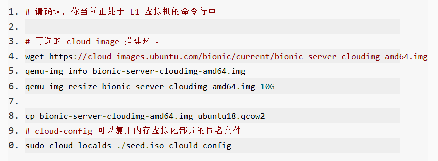
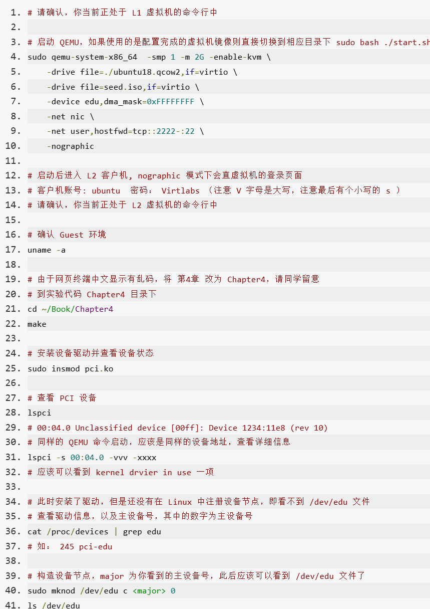
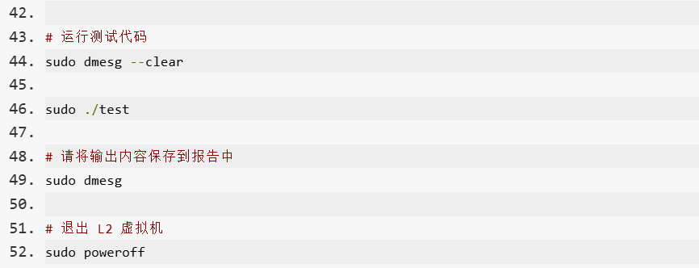

# 实验三: 内存虚拟化

[523031910774] [徐世奇]

## 1 调研部分

##### 1.x86 中 MMIO 与 PIO 的概念（参考书籍的 4.2.2 节）

---
**PIO**：PIO 机制将 I/O 设备的寄存器映射到一个独立的 I/O 地址空间。
有一个独立于内存地址空间的 64KB 地址范围 ，CPU 使用特殊的 I/O 指令来访问这个空间：
**MMIO**：将 I/O 设备的寄存器和/或板载内存映射到 主内存地址空间中的某个区域。CPU 使用普通的内存存取指令来访问这些设备寄存器。


---

##### 2.请调研设备枚举过程并根据你的理解回答设备是如何被发现的（参考书籍的 4.2 节，以及 UEFI 相关内容）

---

设备发现过程的核心是系统如何遍历连接的硬件总线，并识别出总线上挂载的设备。现代 x86 系统主要依赖PCI/PCIe 总线标准进行设备枚举。
每个 PCI/PCIe 设备都有一个专用的 256 字节或 4KB 的配置空间，其中包含了设备的元数据。
系统通过访问特定的 **PCI 配置机制**，遍历所有的 **BDF 地址**。如果某个 BDF 地址上能读到有效的 **Vendor ID**，则表明发现了一个设备。


在现代 x86 系统中，设备枚举主要由 **UEFI** 固件完成，这个过程发生在操作系统启动之前。
UEFI 首先从 **PCI Host Bridge**开始。Host Bridge 会将物理内存和 I/O 地址空间分配给 PCIe 总线。UEFI 固件遍历 Host Bridge 下的所有可能的 总线号，遍历其下的所有可能的 设备号和功能号。如果发现一个PCI/PCIe设备，UEFI 会为该桥分配一条或多条次级总线号，然后递归进入该次级总线，继续重复 BDF 遍历过程。
在发现设备的同时，UEFI 会读取设备配置空间中 BAR 的信息，确定设备需要多少MMIO 空间和I/O 端口空间。
UEFI 固件负责为所有发现的设备分配唯一的、不冲突的物理 MMIO 地址范围和/或 I/O 端口地址。


设备枚举完成后，UEFI 会将一个描述系统硬件拓扑结构和资源分配情况的列表传递给操作系统。


---

## 2 实验目的

---

在 QEMU 中添加模拟的 I/O 设备，即 edu 设备。
在客户机环境安装对应驱动，并使用测试程序访问虚拟设备，请将客户机中的 log 保存到报告中

---

## 3 实验步骤
助教已经完成了第一部分，此处不再重复进行。

实验按照下面的代码及其注释提示进行，得到的log文件内容保存在附录部分。


## 4 实验分析

---

log文件最初的几行反映了驱动程序对设备资源的获取和映射：
[ 472.989627] config 0 34 等行显示驱动程序正在读取 edu 设备的 PCI 配置空间。例如，通过 lspci -s 00:04.0 -vvv -xxxx 可以看到 Vendor ID 和 Device ID。
[ 472.990703] dev->irq a 表明 Linux 内核已成功为 edu 设备分配了中断请求线，即 IRQ 10。这是设备异步通知 CPU 完成任务的关键。
[ 472.991177] io 0 10000ed 显示了驱动程序读取和映射了设备 BAR 0 寄存器分配的地址。


测试程序首先通过 I/O 寄存器访问触发了一个阶乘计算任务：
测试程序向 edu 设备的控制寄存器写入数据，触发阶乘计算。
[ 474.016554] receive a FACTORIAL interrupter! 表明虚拟设备在完成计算后，向 L2 客户机发出了一个中断。
irq_handler irq = 10 dev = 245 irq_status = 1 显示内核中的 edu 驱动程序成功捕获了 IRQ 10，并读取设备状态寄存器，确认状态标志位 1。
[ 475.040113] computing result 375f00 表明驱动程序随后通过读取设备的 MMIO/PIO 寄存器，成功获取了阶乘计算的结果。


[ 475.140508] receive a DMA read interrupter! 和 irq_status = 100 表明设备完成了第一次 DMA 传输，并发送了中断。状态 0x100 通常是 DMA 完成标志。

[ 477.165267] receive a DMA read interrupter! 表明设备完成了第二次 DMA 传输，再次发送中断.

---


## 5 遇到的问题及解决方案
无。


### 附录部分

```
[  472.986564] length 100000
[  472.989627] config 0 34
[  472.989647] config 1 12
[  472.989663] config 2 e8
[  472.989679] config 3 11
[  472.989695] config 4 3
[  472.989711] config 5 1
[  472.989727] config 6 10
[  472.989743] config 7 0
[  472.989759] config 8 10
[  472.989795] config 9 0
[  472.989812] config a ff
[  472.989833] config b 0
[  472.989849] config c 0
[  472.989865] config d 0
[  472.989881] config e 0
[  472.989897] config f 0
[  472.989913] config 10 0
[  472.989929] config 11 0
[  472.989945] config 12 a0
[  472.989961] config 13 fe
[  472.989976] config 14 0
[  472.989993] config 15 0
[  472.990008] config 16 0
[  472.990024] config 17 0
[  472.990040] config 18 0
[  472.990056] config 19 0
[  472.990072] config 1a 0
[  472.990088] config 1b 0
[  472.990104] config 1c 0
[  472.990130] config 1d 0
[  472.990147] config 1e 0
[  472.990163] config 1f 0
[  472.990179] config 20 0
[  472.990194] config 21 0
[  472.990210] config 22 0
[  472.990226] config 23 0
[  472.990242] config 24 0
[  472.990258] config 25 0
[  472.990274] config 26 0
[  472.990290] config 27 0
[  472.990306] config 28 0
[  472.990321] config 29 0
[  472.990337] config 2a 0
[  472.990353] config 2b 0
[  472.990369] config 2c f4
[  472.990385] config 2d 1a
[  472.990401] config 2e 0
[  472.990417] config 2f 11
[  472.990433] config 30 0
[  472.990449] config 31 0
[  472.990471] config 32 0
[  472.990487] config 33 0
[  472.990503] config 34 40
[  472.990519] config 35 0
[  472.990535] config 36 0
[  472.990551] config 37 0
[  472.990585] config 38 0
[  472.990602] config 39 0
[  472.990623] config 3a 0
[  472.990639] config 3b 0
[  472.990655] config 3c b
[  472.990671] config 3d 1
[  472.990687] config 3e 0
[  472.990703] config 3f 0
[  472.990703] dev->irq a
[  472.991177] io 0 10000ed
[  472.991190] io 4 0
[  472.991200] io 8 0
[  472.991211] io c ffffffff
[  472.991221] io 10 ffffffff
[  472.991231] io 14 ffffffff
[  472.991241] io 18 ffffffff
[  472.991266] io 1c ffffffff
[  472.991276] io 20 0
[  472.991289] io 24 0
[  472.991299] io 28 ffffffff
[  472.991310] io 2c ffffffff
[  472.991320] io 30 ffffffff
[  472.991330] io 34 ffffffff
[  472.991339] io 38 ffffffff
[  472.991350] io 3c ffffffff
[  472.991359] io 40 ffffffff
[  472.991369] io 44 ffffffff
[  472.991379] io 48 ffffffff
[  472.991389] io 4c ffffffff
[  472.991399] io 50 ffffffff
[  472.991409] io 54 ffffffff
[  472.991431] io 58 ffffffff
[  472.991441] io 5c ffffffff
[  472.991455] io 60 ffffffff
[  472.991473] io 64 ffffffff
[  472.991483] io 68 ffffffff
[  472.991493] io 6c ffffffff
[  472.991503] io 70 ffffffff
[  472.991513] io 74 ffffffff
[  472.991523] io 78 ffffffff
[  472.991533] io 7c ffffffff
[  472.991542] io 80 0
[  472.991552] io 84 ffffffff
[  472.991562] io 88 0
[  472.991572] io 8c ffffffff
[  472.991582] io 90 0
[  472.991592] io 94 ffffffff
[  472.994079] irq_handler irq = 10 dev = 245 irq_status = 12345678
[  474.016554] receive a FACTORIAL interrupter!
[  474.016563] irq_handler irq = 10 dev = 245 irq_status = 1
[  475.040113] computing result 375f00
[  475.140508] receive a DMA read interrupter!
[  475.140517] irq_handler irq = 10 dev = 245 irq_status = 100
[  477.165267] receive a DMA read interrupter!
[  477.165277] irq_handler irq = 10 dev = 245 irq_status = 100
```