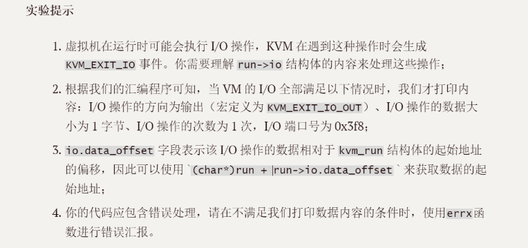
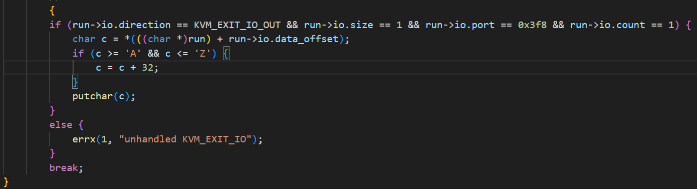
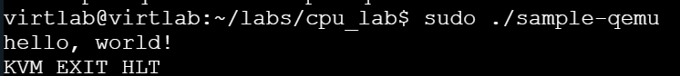

# 实验一: CPU 虚拟化

[523031910774] [徐世奇]

## 1 调研部分

##### 1.请根据你的理解解释可虚拟化架构与不可虚拟化架构的概念（参考书籍 2.1 节）
......可虚拟化架构指的是满足虚拟化三项要求的架构，首先是所有的敏感指令(影响系统资源和状态的指令)都属于特权指令，其次是特权指令在非特权态下执行会引发异常，访客操作系统触及到这种情况时，将会把控制权返还给虚拟机监视器(VMM)，最后是 VMM 能够完全控制对所有物理资源的访问，高效拦截敏感操作，并且模拟出访客操作系统期望的效果。
......不可虚拟化架构则是指不满足上述三项要求的架构，包括存在敏感指令，存在一些敏感指令在非特权态下执行时不会引发异常，vmm 无法完全控制对所有物理资源的访问等情况。

##### 2.请基于你的理解谈谈虚拟化的“陷入再模拟”的概念（参考书籍 1.3.3 节）
......“陷入再模拟”是一种软件虚拟化技术，他允许虚拟监视器在不更改访客操作系统代码的情况下，拦截并处理敏感指令。
......“陷入”指的是当访客操作系统在执行敏感指令的时候，CPU会检测违规，并且将控制权转移给虚拟机监视器，比如VMM，这个硬件触发异常(陷入)并且转移控制权的过程就叫做“陷入”。
随后，vmm会查询“陷入”原因(比如具体指令位置)，vmm必须确保访客操作系统只能操作自己的虚拟资源。
......“模拟”指的是vmm根据敏感指令的要求，并非实际直接执行，而是按照敏感指令意图，在访客操作系统的虚拟资源上进行相应的操作，而不会更改实际的资源，这个过程就叫做“模拟”。

##### 3.请调研并用你的理解解释 Intel VT-x 的特权级是如何划分的。这种非根模式为何有助于 Hypervisor “陷入再模拟”（参考书籍2.2节）？
......Intel VT-x 的特权级划分为两种模式：根模式和非根模式。根模式是指虚拟机监视器(VMM)运行的特权级别，拥有对所有硬件资源的完全控制权限。而非根模式是指访客操作系统运行的特权级别，受限于VMM的控制，无法直接访问硬件资源。
......非根模式的核心价值在于硬件控制的退出机制，即 VM-Exit，这相当于将软件的“陷阱”过程硬件化了，在传统x86架构中，敏感非特权指令不会陷入vmm，但是在非根模式下，vmm可以配置触发VM-Exit的条件，可以配置所有敏感指令为VM-Exit条件，当访客os在非根模式下访问这些指令，CPU硬件直接终止访客os，切换到根模式，将控制权给予vmm，这个过程比“陷入”更加高效。
......同时，非根模式下vmm在物理内存中为每个vCPU创建一个VMCS，这个结构会存储访客os的状态信息，当访客os被切换出去时，vmm可以保存访客os的状态，并且在切换回来时恢复访客os的状态，这样vmm就可以完全控制访客os的执行环境，确保访客os只能操作自己的虚拟资源，从而实现“再模拟”。
## 2 实验目的

......掌握 VM 执行 I/O 操作时，如何触发 KVM_EXIT_IO 事件（即“陷入”过程）
......完成KVM模块对 I/O 操作的模拟处理，即补充 case KVM_EXIT_IO 分支的代码。
......实现一个特定的 I/O 功能：捕获访客 VM 向特定 I/O 端口（0x3F8）写入的 “Hello World!” 字符串，并将其大小写反转后，打印到宿主机（Host）的标准输出中。
## 3 实验步骤

按照实验提示的要求，成功编写了基础代码，只是没有实现大小写功能
 
在后来通过局部变量char捕获内容，然后修改，putchar函数返回到宿主机标准输出，成功实现功能 
  

## 4 实验分析

VM 往端口写入的“Hello World!”字符串变为小写后成功打印到标准输出中，如下图：
 

## 5 遇到的问题及解决方案

最开始想要使用ctype.h的库来实现大写的翻转，但是太麻烦了，随后使用了ASCELL编码快速实现了。

## 附录

/* Sample code for /dev/kvm API
 *
 * Copyright (c) 2015 Intel Corporation
 * Author: Josh Triplett <josh@joshtriplett.org>
 *
 * Permission is hereby granted, free of charge, to any person obtaining a copy
 * of this software and associated documentation files (the "Software"), to
 * deal in the Software without restriction, including without limitation the
 * rights to use, copy, modify, merge, publish, distribute, sublicense, and/or
 * sell copies of the Software, and to permit persons to whom the Software is
 * furnished to do so, subject to the following conditions:
 *
 * The above copyright notice and this permission notice shall be included in
 * all copies or substantial portions of the Software.
 *
 * THE SOFTWARE IS PROVIDED "AS IS", WITHOUT WARRANTY OF ANY KIND, EXPRESS OR
 * IMPLIED, INCLUDING BUT NOT LIMITED TO THE WARRANTIES OF MERCHANTABILITY,
 * FITNESS FOR A PARTICULAR PURPOSE AND NONINFRINGEMENT. IN NO EVENT SHALL THE
 * AUTHORS OR COPYRIGHT HOLDERS BE LIABLE FOR ANY CLAIM, DAMAGES OR OTHER
 * LIABILITY, WHETHER IN AN ACTION OF CONTRACT, TORT OR OTHERWISE, ARISING
 * FROM, OUT OF OR IN CONNECTION WITH THE SOFTWARE OR THE USE OR OTHER DEALINGS
 * IN THE SOFTWARE.
 */
#include <err.h>
#include <fcntl.h>
#include <linux/kvm.h>
#include <stdint.h>
#include <stdio.h>
#include <stdlib.h>
#include <string.h>
#include <sys/ioctl.h>
#include <sys/mman.h>
#include <sys/stat.h>
#include <sys/types.h>

int main(void)
{   int kvm, vmfd, vcpufd, ret;
    const uint8_t code[] = {
        0xba, 0xf8, 0x03, /* mov $0x3f8, %dx */
        0xb0, 'H',       /* mov $'H', %al */
        0xee,             /* out %al, (%dx) */
        0xb0, 'e',       /* mov $'e', %al */
        0xee,             /* out %al, (%dx) */
        0xb0, 'l',       /* mov $'l', %al */
        0xee,             /* out %al, (%dx) */
        0xb0, 'l',       /* mov $'l', %al */
        0xee,             /* out %al, (%dx) */
        0xb0, 'o',       /* mov $'o', %al */
        0xee,             /* out %al, (%dx) */
        0xb0, ',',       /* mov $',', %al */
        0xee,             /* out %al, (%dx) */
        0xb0, ' ',       /* mov $' ', %al */
        0xee,             /* out %al, (%dx) */
        0xb0, 'w',       /* mov $'w', %al */
        0xee,             /* out %al, (%dx) */
        0xb0, 'o',       /* mov $'o', %al */
        0xee,             /* out %al, (%dx) */
        0xb0, 'r',       /* mov $'r', %al */
        0xee,             /* out %al, (%dx) */
        0xb0, 'l',       /* mov $'l', %al */
        0xee,             /* out %al, (%dx) */
        0xb0, 'd',       /* mov $'d', %al */
        0xee,             /* out %al, (%dx) */
        0xb0, '!',       /* mov $'!', %al */
        0xee,             /* out %al, (%dx) */
        0xb0, '\n',       /* mov $'\n', %al */
        0xee,             /* out %al, (%dx) */
        0xf4,             /* hlt */
    };
    uint8_t *mem;
    struct kvm_sregs sregs;
    size_t mmap_size;
    struct kvm_run *run;

    kvm = open("/dev/kvm", O_RDWR | O_CLOEXEC);
    if (kvm == -1)
        err(1, "/dev/kvm");

    /* Make sure we have the stable version of the API */
    ret = ioctl(kvm, KVM_GET_API_VERSION, NULL);
    if (ret == -1)
        err(1, "KVM_GET_API_VERSION");
    if (ret != 12)

        errx(1, "KVM_GET_API_VERSION %d, expected 12", ret);

    vmfd = ioctl(kvm, KVM_CREATE_VM, (unsigned long)0);
    if (vmfd == -1)
        err(1, "KVM_CREATE_VM");

    /* Allocate one aligned page of guest memory to hold the code. */
    mem = mmap(NULL, 0x1000, PROT_READ | PROT_WRITE, MAP_SHARED | MAP_ANONYMOUS, -1, 0);
    if (!mem)
        err(1, "allocating guest memory");
    memcpy(mem, code, sizeof(code));

    /* Map it to the second page frame (to avoid the real-mode IDT at 0). */
    struct kvm_userspace_memory_region region = {
        .slot = 0,
        .guest_phys_addr = 0x1000,
        .memory_size = 0x1000,
        .userspace_addr = (uint64_t)mem,
    };
    ret = ioctl(vmfd, KVM_SET_USER_MEMORY_REGION, &region);
    if (ret == -1)
        err(1, "KVM_SET_USER_MEMORY_REGION");

    vcpufd = ioctl(vmfd, KVM_CREATE_VCPU, (unsigned long)0);
    if (vcpufd == -1)
        err(1, "KVM_CREATE_VCPU");

    /* Map the shared kvm_run structure and following data. */
    ret = ioctl(kvm, KVM_GET_VCPU_MMAP_SIZE, NULL);
    if (ret == -1)
        err(1, "KVM_GET_VCPU_MMAP_SIZE");
    mmap_size = ret;
    if (mmap_size < sizeof(*run))
        errx(1, "KVM_GET_VCPU_MMAP_SIZE unexpectedly small");
    run = mmap(NULL, mmap_size, PROT_READ | PROT_WRITE, MAP_SHARED, vcpufd, 0);
    if (!run)
        err(1, "mmap vcpu");

    /* Initialize CS to point at 0, via a read-modify-write of sregs. */
    ret = ioctl(vcpufd, KVM_GET_SREGS, &sregs);
    if (ret == -1)
        err(1, "KVM_GET_SREGS");
    sregs.cs.base = 0;
    sregs.cs.selector = 0;
    ret = ioctl(vcpufd, KVM_SET_SREGS, &sregs);
    if (ret == -1)
        err(1, "KVM_SET_SREGS");

    /* Initialize registers: instruction pointer for our code, addends, and
     * initial flags required by x86 architecture. */
    struct kvm_regs regs = {
        .rip = 0x1000,
        .rax = 2,
        .rbx = 2,
        .rflags = 0x2,
    };
    ret = ioctl(vcpufd, KVM_SET_REGS, &regs);
    if (ret == -1)
        err(1, "KVM_SET_REGS");

    /* Repeatedly run code and handle VM exits. */
    while (1) {
        ret = ioctl(vcpufd, KVM_RUN, NULL);
        if (ret == -1)
            err(1, "KVM_RUN");
        switch (run->exit_reason) {
        case KVM_EXIT_HLT:
            puts("KVM_EXIT_HLT");
            return 0;
        case KVM_EXIT_IO:
        // --------------------------------------
        //---------- START YOUR CODE -------------
        {
        if (run->io.direction == KVM_EXIT_IO_OUT && run->io.size == 1 && run->io.port == 0x3f8 && run->io.count == 1) {
            char c = *(((char *)run) + run->io.data_offset);
            if (c >= 'A' && c <= 'Z') {
                c = c + 32; 
            }
            putchar(c);
        }
        else {
            errx(1, "unhandled KVM_EXIT_IO");
        }
        break;
}

        // --------- END OF YOUR CODE ------------
        //  ------------------------------------- 
        case KVM_EXIT_FAIL_ENTRY:
            errx(1, "KVM_EXIT_FAIL_ENTRY: hardware_entry_failure_reason = 0x%llx",
                 (unsigned long long)run->fail_entry.hardware_entry_failure_reason);
        case KVM_EXIT_INTERNAL_ERROR:
            errx(1, "KVM_EXIT_INTERNAL_ERROR: suberror = 0x%x", run->internal.suberror);
        default:
            errx(1, "exit_reason = 0x%x", run->exit_reason);
        }
    }
}

