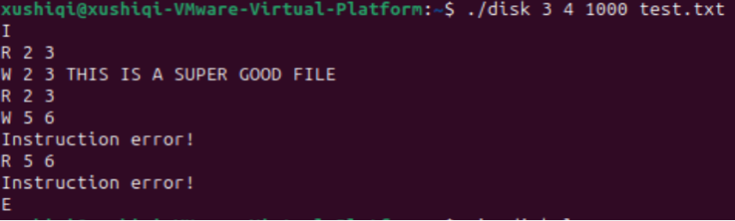
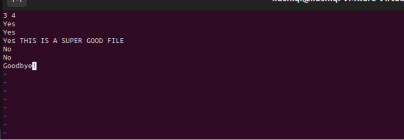
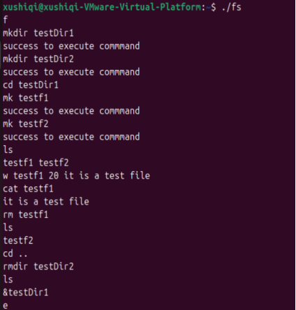
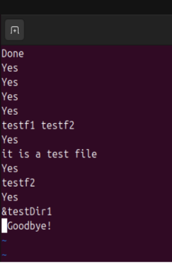

# <center>Project3 Typescript</center>
### some details about project 3
## step1
### Usage
first compile the code using the makefile in step1 directory
```shell
make
```
then run the disk program with the following command
```shell
 ./disk <#cylinders> <#sector per cylinder> <track-to-track delay> <#disk-storagefilename>
```
let me show you an example
```shell
./disk 3 4 1000 test.txt
```
the result:
  
and the disk.log file:
  
## step2
### Usage
first compile the code using the makefile in step1 directory
```shell
make
```
then run the disk program with the following command
```shell
 ./fs
```
let me show you an example
  
the fs.log is like this:
  
## step3
### Usage
first compile the code using the makefile in step1 directory
```shell
make
```
then run the disk program with the following command
```shell
./disk1 <#cylinders> <#sector per cylinder> <track-to-track delay> <#disk-storagefilename> <disk port>
./fs <disk port> <fs port>
./client <fs port></fs>
```
then you can run the program.
some pictures are shown in the report.