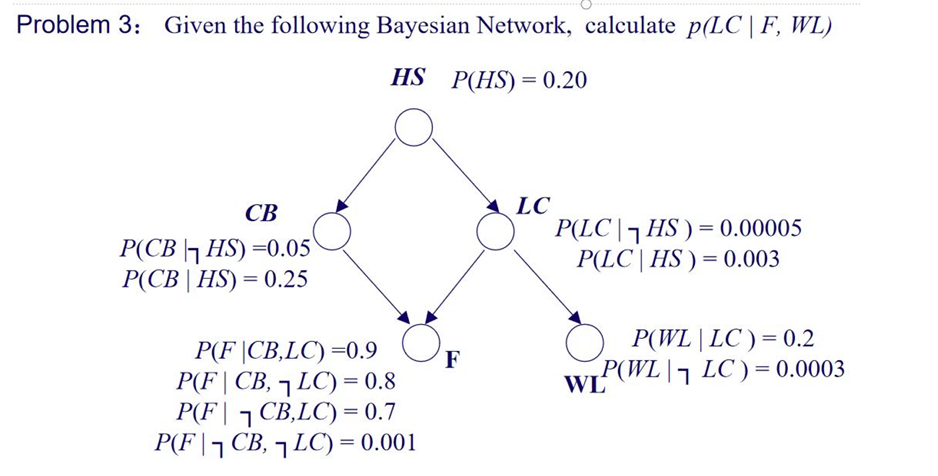

### 机器学习第八次作业
---
#####  
Problem 1: Using the axioms of probability, prove
$$
p(P \mid P \land Q) = 1
$$

---
$p(P|P \land Q) = \frac{p(P \land (P \land Q))}{p(P \land Q)}$。
根据逻辑幂等律和结合律，$P \land (P \land Q)$等价于$P \land Q$。
因此：$p(P|P \land Q) = \frac{p(P \land Q)}{p(P \land Q)} = 1$。

---

Problem 2: Given the Bayesian Network
- Calculate $p(P \Rightarrow Q)$

$= p(\neg P \lor Q) = p(\neg P) + p(Q) - p(\neg P \land Q)=p(\neg P) + p(P \land Q)$

- In what condition, the following relation is held
  $$p(P \Rightarrow Q) = p(Q|P)$$

$p(\neg P) + p(P \land Q)=\frac{p(P \land Q)}{p(P)}$
求解得到：
$(p(\neg P))(p(P)-p(P \land Q))=0$

则需要满足下面两个条件其中之一：
- $p(P) = 1$: 此时$p(Q|P) = p(Q)$, 且$p(P \Rightarrow Q) = p(Q)$。
- $p(P \Rightarrow Q) = 1$

---

---
$$
p(LC|F,WL) = \frac{p(LC,F,WL)}{p(F,WL)} = \frac{p(LC,F,WL)}{p(LC,F,WL) + p(\neg LC,F,WL)}
$$

计算$p(LC)$：
$$
\begin{align*}
p(LC) &= p(LC|HS)p(HS) + p(LC|\neg HS)p(\neg HS) \\
&= (0.003 \times 0.20) + (0.00005 \times 0.80) \\
&= 0.0006 + 0.00004 = 0.00064 \\
p(\neg LC) &= 1 - 0.00064 = 0.99936
\end{align*}
$$

计算$p(CB)$：
$$
\begin{align*}
p(CB) &= p(CB|HS)p(HS) + p(CB|\neg HS)p(\neg HS) \\
&= (0.25 \times 0.2) + (0.05 \times 0.8) = 0.09 \\
p(\neg CB) &= 0.91
\end{align*}
$$
$$
\begin{align*}
p(F|LC) &= p(F|CB,LC)p(CB) + p(F|\neg CB,LC)p(\neg CB) \\
&= (0.9 \times 0.09) + (0.7 \times 0.91) \\
&= 0.081 + 0.637 = 0.718 \\
p(F|\neg LC) &= p(F|CB,\neg LC)p(CB) + p(F|\neg CB,\neg LC)p(\neg CB) \\
&= (0.8 \times 0.09) + (0.001 \times 0.91) \\
&= 0.072 + 0.00091 = 0.07291
\end{align*}
$$

代入最后结果：
$p(LC,F,WL) = p(F|LC) \times p(WL|LC) \times p(LC) = 0.718 \times 0.2 \times 0.00064 \approx 0.0000919$
$p(\neg LC,F,WL) = p(F|\neg LC) \times p(WL|\neg LC) \times p(\neg LC) = 0.07291 \times 0.0003 \times 0.99936 \approx 0.0000219$

$$
p(LC|F,WL) = \frac{0.0000919}{0.0000919 + 0.0000219} \approx 0.807
$$