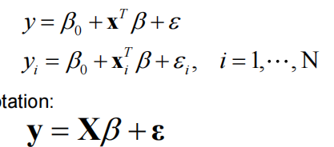

一.
1。方差，偏差，不可约误差。
正则化，随机失活，数据增强，提前停止。
2.具体看笔记，不会减少，可能会增加
---
note：单个样本x是列向量，矩阵X行为样本列为特征，所以会不一样。

---
3.线性函数族的VC是维度加一，即p+1，因为可以构造$Xβ=Y$然后任意指定y为0或者1，由于X第一列为1，所以是n+1维，是个方阵可逆，所以可以得到一个β用来分割。

4.可以看极端值，0和无穷。题目中会越来越少，因为惩罚力度越来越大了。

二.
1.主要注意y=fx+epsilon，这个fx是真实函数而不是预测函数，后面的参数表示噪音，主要用于同样数据的不同差异，与前面的fx无关。
2.维度变高之后，数据点会变得稀疏，在样本数量不变的情况下，相互距离会更远，最近和最远的距离平均意义上接近，此时违背了KNN的局部特性，是在全空间里面选择。

三。很简单，就是作业题目

四。
