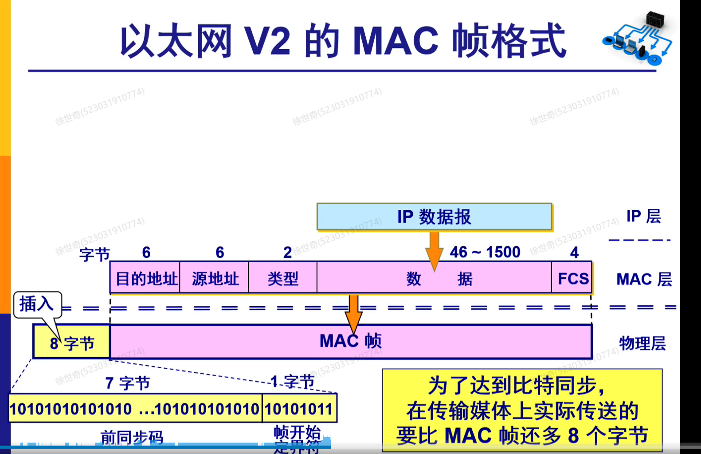
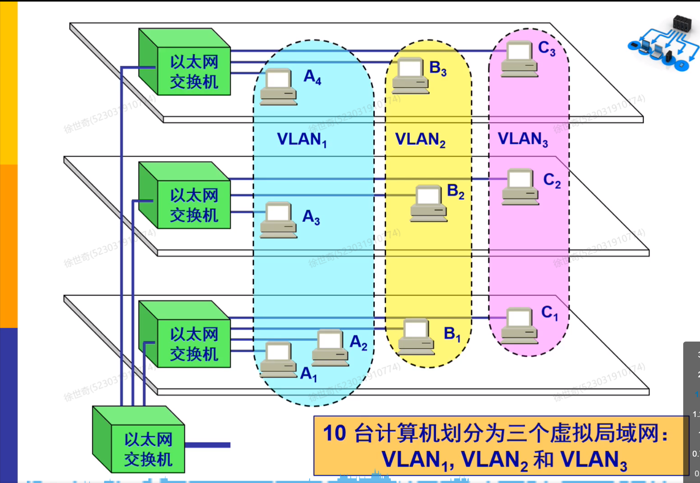
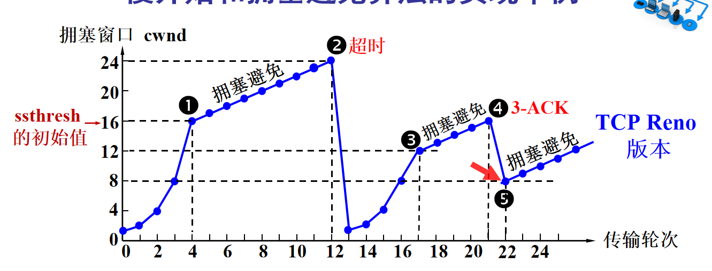

### lec1:物理层
##### 1.zigbee：
spread：对于01序列，zigbee采取直接序列扩频，将连续的四个比特变成32个比特（chips），即8倍冗余
modulation：将所有奇数位和偶数位分别进行调制，生成离散的符号（即在一条线，如果是1，画在上面，如果是0，画在下面），奇数和偶数调制的图形是有错开的部分
pulse shaping:对于之前的信号进行卷积，生成波形图。
DAC：生成模拟信号
radio front-end:乘以载波，载波的包络线为传递的信号，载波密度反映了信号的频率
为何奇数和偶数要错开?
下图是信号对应生成的f信号：可见如果是脉冲，那么会影响全局，为了减少脉冲对于全局信号的影响，将奇数和偶数错开，防止脉冲叠加，使得其可以平滑处理。
  
解码：就是前面过程的逆过程，不同之处在于pulse shaping的逆过程是查看一段序列，然后选取其中的点确定是1还是0（half-sine假设是6个点，他会选择一个点来判断这是0还是1，然后将其转换为比特位）
为什么要分成奇数和偶数？
可以在同一频率下传输两路信号，提升传输效率，他们似乎是正交的，所以不会互相影响。

zigbee传输速率：2Mbps*1/8（spread）*1/2（奇偶分开）=125kbps

##### 2.WiFi
信号调制方式：BPSK，QPSK，16-QAM，64-QAM
对应了携带的数据量。bpsk携带1bit，QPSK携带2bit，16-QAM携带4bit，64-QAM携带6bit
bpsk：将01分别映射到0和180度，抗干扰能力强，因为就只有两个半平面
QPSK：将00，01，10，11分别映射到0，90，180，270度
16-QAM：将4bit映射到16个点上，4个点为一组，分别在0，90，180，270度上，加入幅度1,3.

64路：将整个信道拆分为64路，进行调制和叠加，他们互相正交所以互不干扰，将数据流通过64路不同的频率进行发送，这样对比单通道运输，相当于原先是一个大卡车运输，现在是拆分为64个小卡车运输，提升了运输效率，提高了抗干扰能力，但是问题在于先调制再整合需要大量重复的硬件资源，所以后面采取了先整合再调制技术。（傅里叶变换特性）

### lec3 数据链路层
使用帧方式传输，在帧的首尾加入符号
问题：在帧内部可能会出现结束符导致后面被当做无效帧
是否可以固定长度（透明传输）：降低了灵活性，可能很小的数据却用了很长的帧，里面全是空白
字节填充：在每个字节前面加上转义符，如果遇到转义符或者结束符或者开始符，就在前面加上转义符。当接受端得到一个目标字符（开始结束转义）前面有转义符，那么就去掉转义符，恢复原始数据，如果没有，那么就是开始或者结束符

为了提供校验功能，双方共享一个二进制的校验除数，先将数据扩展（校验除数-1位，全0），然后用校验除数去处理比特流数据（用异或代替除法），将余数代替扩展位，将其发送，如果接收端用同样的方法发现余数是0，那么说明没有错误，否则说明有错误
但是这个一般适用于局域网里面，干扰比较少时，否则有可能在内部有错误数据，导致最后余数为0

##### PPP协议：
头部尾部加东西，头部似乎是协议什么的
透明传输问题：同步和异步传输方式
零比特填充，对于和信息头相同的字符，比如7E，在中间某位比如第五位插入0
字符填充：将信息头重复字符，更改比如7E变成7D 5E，如果原来内容就有7D，就改成7D 5D，这样接受方会接受到7D或者7E转义字符反向解码。后面那种方式是为了避免重复转义字符。

##### 广播信道的数据链路层
##### CSMA/CD协议：
总线连接
载波监听，碰撞检测
需要检测信道是否空闲，发送过程中要保持对于电压信号的检测，防止和其他信号碰撞
最小帧长度，传播时间需要大于信号在两端传递的时间之和，所以是两个r
为了提高效率，较小的帧长度会影响有效数据传输时间T0，而以太网连线长度限制会导致τ太大，传播时延变长。
最小帧长度：为了避免机器完成发送，从而认为冲突与自己无关，我们需要增加帧的长度到2τ的程度。
binary exponential backoff:冲突后会在几个可选时间里面选择，如果再冲突增大选择的时延空间，时延空间就比如{0,2,4,8}
所以随着空间增大，冲突概率会越来越小。

### lec4 数据链路层和网络层

##### MAC层
硬件地址，也叫物理地址，MAC地址

有比特同步。
CRC循环冗余校验，链路层都是将校验放在末尾，因为需要遍历整个数据，所以放在末尾避免二次遍历。但是其他协议似乎是放在头部的，可能实现方式不一样。
FCS就是CRC实现。
mac尾部没有内容附加：因为使用曼切斯特编码，帧与帧之间有一段时间，所以不需要。
mac与ip不同的是，它是局域网寻址。

##### 交换机
用来存储mac地址表，接口，和有效时间。
hacker可以通过从不同接口发送请求填满mac地址表用来攻击。
虚拟局域网，在以太网帧格式里面增加了vlan标记表示属于哪个虚拟局域网

交换机是全双工的(可同时发送接收)，所以不需要碰撞检测。

#### 网络层
将可靠性功能放在客户端而不是放在路由器上，因为路由器主要是数据转发，不应该有太多时延，同时国家和运营商管理中间基本的部分，具体问题应该让客户端自己解决。
IP为不可靠无连接的方式。
IP地址不够用的话：动态IP，NAT，IPV-6
#### NAT
局域网使用一个公有ip上网，路由器负责存储私有地址和公有地址的映射表。
源地址和端口号都会改变，端口号动态变化，因为局域网里面可能有多个机器同时访问，所以不能映射到同一个端口。
但是别人无法访问到它，因为他隐藏在NAT后面了，破坏了端到端end-to-end。
#### ARP
局域网内每台主机ip唯一，传输数据需要将ip翻译为mac地址
ARP高速缓存负责存储某个主机ip到mac的映射，表是动态的缓存，收到查询才更新或者取出
不能直接用mac来网络通信，因为每台主机型号不同前缀mac不同，无法辨别他们是同一个局域网的
#### 划分子网
让ip地址变为三级，可以防止路由器变得臃肿，快速查询，同时提高ip地址利用率
主机号全0全1不用，所以主机号数量是2的比特次方-2.
IP地址：网络号+子网号+主机号：比如要8个子网，每个子网预计有20个主机，那么就分配最后5位给主机，5位前3位为子网，二进制转换为10进制，比如001 00000就是.32
子网掩码：通过与ip地址进行与运算，比如255.255.255.0，与ip与运算后，就可以划分为网络部分和另外保留的主机部分，通过比较网络部分可以确定是否在一个局域网里面。子网掩码后剩下0对应的部分都是主机号
CIDR表示法，用于表示子网：194.24.0.0/24后面的24表示网络号为24位。就表示一个网络范围，其中 IP 地址从  开始，到 194.24.0.255 结束，共有 254 个可用的主机 IP 地址
但是ip地址分配可能是比较散乱的，相邻的比如194.24.0.0/24和194.24.1.0/24不在一个地区
CIDR HOLE：为了聚合子网，但是有些子网可能与其他组子网不在一个地区，会导致消息流量的错误发送。因此更改后缀，比如把194.24.0.0/24到后面8个子网合并为194.24.0.0/21。对于不在一个地区的子网，更改为194.24.7.0/24，采用最长匹配用来知道路由器跳转。

#### 互联网路由选择协议
LSR；路由器自己算，把结果给其他路由，然后Dijkstra计算整个网络最短路径。
DVR：路由器通过自己的邻居迭代知道到每个目的地的最小距离，用Bellman-Ford来迭代更新路由表，这个算法复杂度低于前一个，但是要迭代，计算简单，内存等资源占用少。
DVR问题：好消息传递的块，新加入路由器，网络可以很快更新各自路由表。但是如果某一个路由表故障，那么其他路由器就可能会来回更新到这个路由器的距离，导致距离会缓慢增加而不是直接设置为无穷大，导致网络效率低下。
Hierarchical routing：分层路由，将多个路由分在同一组里面，有内部网关和外部网关。

#### 内部与外部网关协议
定义距离
RIP：只选择最少的路由数量，多于16认为无法跳转，用bell，有其缺点。
OSPF：有分层设计，距离考虑带宽成本，知道网络拓扑图，用dij。
BGP：策略优先，基于商业协议，成本等选择路径，有自己的AES号码，如果在路径中看到了自己的号码，会拒绝，防止计数无穷大，有些像DVR方法，依靠邻居。

#### IPV-6
相对于IPV-4，扩展了地址的数量，将IPV-4中首部不常用的功能放入了扩展首部中。IPV-6可以选择三种模式，点对点，广播，任播。可以零压缩，但只支持一次。数据段传输经过的路由器不处理扩展首部，只有一个跳过首部的首部例外。大大提高了路由效率
双协议栈，隧道技术。
#### IP多播
IGMP协议：用来实现IP多播，有局域网和互联网上的。

### lec5 传输层
路由器只处理下三层
传输层主要是用来处理不同主机上不同进程之间的通信
计算UDP校验和，是不要求掌握的
UDP可以差错检验，方法是反码求和结果再求反码，顺序无关。
TCP窗口不可太大，否则会爆掉接受方存储。每接受一个ack，向前移动一格，每一格代表一个分组。
累积确认只需在接受方发送最后一个接受分组的ack即可
持续计时器防止死锁。
(NAGGLE算法)

#### 拥塞控制
TCP的拥塞窗口取决于接受方公告和网络拥塞程度，越拥挤越小。
判断拥塞的方法一般是看重传定时器超时或者受到3个相同的ACK表示可能会出现拥塞。(为什么会出现3个，以后会再讲)
TCP拥塞控制算法：
- 慢开始：逐步翻番拥塞窗口数量，1,2,4,8.每个轮次是一个往返时间RTT
- 拥塞避免算法(迷惑的名字)：使用加法增大窗口数量，1,2,3,4

一起拿来实际使用，用一个门限值来控制，最开始采取慢开始，到达门限值，采取拥塞避免，如果遇到拥塞的两种情况，那么就减半门限，将拥塞窗口置于初始值，计算循环上面步骤。

- 快重传算法：只要一连收到三个重复确认，就立刻重传。

- 快恢复：在3次确认时，可能会是报文段丢失，也有可能是拥堵，为了避免报文段丢失导致整个窗口重置，所以在快重传后，不进入慢开始，而是将门限值减半，拥塞窗口置为门限值，然后进入拥塞避免阶段，这样可以维持一定的网络效率。比如在图里面的第四个点以及他的操作是窗口减半。

#### TCP连接
三次握手建立连接，四次报文握手连接释放

### lec6 应用层
#### DNS
一般都是四级或者三级域名，域名点数多少表示级数，这个和IP的点没有任何关系，只是方便记忆，同时顶级域名不一定表示地区。
域名服务器有四种。域名解析是迭代查询不是递归查询，即本地域名服务器与不同的域名服务器通信，直到找到最终结果，而不是逐步通过其他服务器返回结果。
#### 文件传送协议ftp
ftp会占用两个端口，使用tcp
tftp使用udp传输文件，没有连接，没有拥塞控制，适用于小文件传输，由于传输层为udp的原因，因此需要应用层自己实现可靠传输。比如停止等待之类的
telnet，远程登录
#### 万维网
万维网是超文本系统的扩充，是一个巨大的信息存储所。
用url定位资源，http协议传输
代理服务器proxy server：用来缓存网页，减少访问时间，同时可以过滤一些不良网站。
html和xml，xml是用来传输数据。
活动文档：计算是在客户端进行的，服务端只负责传输数据。比如页面游戏，服务器一开始将图片等资源传输给客户端，后面只传输参数等。