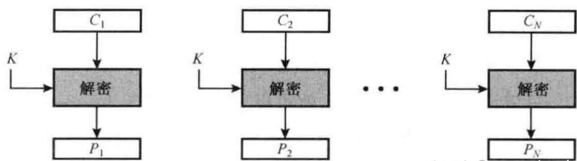

#### 第四次课后作业
---
##### 1. 对4种使用模式
##### ▪ 分别写出解密算法（以$𝐷𝑒𝑐_k(∗)$或$𝐹𝐾^{−1}(∗)$代表单个分组解密算法），并画出解密流程图。
解密算法：
**ECB**：$m_i = F_{K}^{-1}(C_i)$

**CBC**: $m_i = F_{K}^{-1}(C_i) \oplus C_{i-1}$ (其中 $C_0 = IV$),从低位向高位解密

**OFB**: $m_i = C_i \oplus O_i$ (其中 $O_i = F_{K}(O_{i-1})$ 且 $O_0 = IV$)

**CTR**：$m_i = C_i \oplus O_i$(其中$O_i = F_K(\text{Counter}_i)$，Counter=ctr+i)

##### ▪ 以列表形式说明是否可以用于流加密、是否可以并行加解密、是否有差错扩散
流加密是指用密钥流逐比特异或加密明文
| 分组密码模式 | 可用于流加密 | 可并行加密 | 可并行解密 | 有差错扩散 |
|--------------|--------------|------------|------------|------------|
| ECB          | 否           | 是         | 是         | 否         |
| CBC          | 否           | 否         | 是         | 是         |
| OFB          | 是           | 是         | 否         |  否        |
| CTR          | 是           | 是         |    是      | 否         |

---

##### 2.对于ECB、CBC而言，明文必须为一个或多个完整数据分组组成的序列。即对于此三种模式，明文的总位数必须是分组（分段）长度的整数倍。若明文最后一段不是分组（分段）长度的整数倍，常见的填充方式包括先填1，后面全部为0（也可能没有），知道填满最后一个分组。但是，通常要求当明文最后一段为分组（分段）长度的整数倍时，也要再添加一个填充分组。动机是什么？

为了保证解密端能够**无歧义**地确定明文的原始长度。
采用填充机制的分组密码模式，解密端必须能够识别并移除添加的填充字节，才能恢复原始的明文。
比如考虑下面的情况，padding规则参照课件的填充n个字节的0n内容。
**最后一段不是分组长度的整数倍：**
 原始明文： `...AA BB CC` (长度为 3 字节，需要填充 5 字节，即 $k=5$)
 加密明文： `...AA BB CC 05 05 05 05 05`
解密后，检查最后一个分组的最后一个字节是 `05`，就知道需要移除最后 5 个字节（`05 05 05 05 05`）。
这个没有歧义。

**当明文长度恰好是分组长度的整数倍时**

原始明文： `...XX YY ZZ` (长度为 8 字节，正好填满一个分组)
当最后一部分的值恰好等于padding对应的内容，比如下面这种，解密端会识别出两种情况：

|  | 最后一个分组的内容 | 原始明文长度 | 填充字节数 |
| :--- | :--- | :--- | :--- |
| **情况 A** | `...XX YY 01` | 8 字节 | 0 字节 |
| **情况 B** | `...XX YY` | 7 字节 | 1 字节 |

如果解密端看到 `...XX YY 01`，它无法确定 `01` 是原始明文的一部分（情况 A），还是一个表示“填充了 1 个字节”的填充标记（情况 B）。

为了消除上述歧义，标准要求：

 当明文**刚好**填满一个完整分组时，**必须**额外添加一个完整的填充分组 $P_n$。这个填充分组的**所有字节**都设置为分组长度 $n$。

 于是 `...XX YY ZZ` $\to$ `...XX YY ZZ | n n n n n n n n`

    如果最后一个字节的值 $k < n$，则解密端移除 $k$ 个字节。
    如果最后一个字节的值 $k=n$，则解密端移除 $n$ 个字节（即整个最后一个分组）。

这样，无论原始明文长度如何，解密端都可以根据最后一个分组末尾的填充字节值，**唯一确定**需要移除的填充字节数量，从而保证恢复的明文是正确的。

---

##### 3.线性同余法中为何使用$2^{31}-1$，而不是$2^{31}$？
当模数m取2的幂次，即$2^{31}$时：
由于ac要求分别是奇数，所以最低位周期最多只有2，即010101得变化。
同时低b个比特组成的序列，周期最多只有$2^{b}$，这导致高位和低位之间的影响减少。
当m为$2^{31}-1$时，这是一个素数，可以实现高周期$P=m-1=2^{31}-2$，同时可以实现高位和低位分布的更加均匀