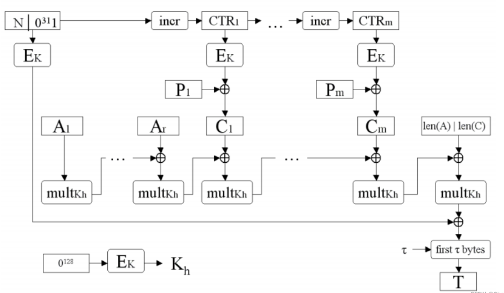
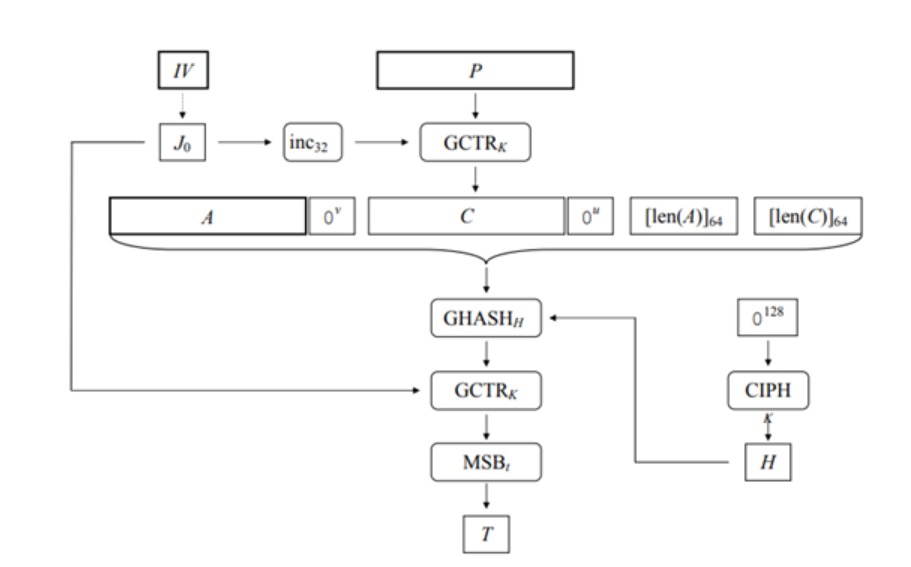

#### 第六次课后作业
---
设\( p \)是一个大素数，且\( q=(p-1)/2 \)也是一个素数。

设\(\alpha\)和\(\beta\)是\(\mathbb{Z}_p\)的两个本原元，值\(\log_\alpha \beta\)是不公开的，且假定计算\(\log_\alpha \beta\)是困难的（计算上不可行）。

$$
h:\begin{cases} \mathbb{Z}_q \times \mathbb{Z}_q \to \mathbb{Z}_p \setminus \{0\} \\ \mathbf{h}(x_1, x_2) = \alpha^{x_1} \beta^{x_2} \bmod p \end{cases}
$$

证明：此处的$\mathbf{h}$是一个强抗碰撞 Hash 函数。

---

假设找到了一段输入：$(\mathbf{x}_1, \mathbf{x}_2) \ne (\mathbf{x}'_1, \mathbf{x}'_2)$，使得它们的哈希值相同：

$$h(x_1, x_2) = h(x'_1, x'_2) \pmod p$$

$$\alpha^{x_1} \beta^{x_2} \equiv \alpha^{x'_1} \beta^{x'_2} \pmod p$$

$$\alpha^{x_1 - x'_1} \equiv \beta^{x'_2 - x_2} \pmod p$$

令 $\Delta x_1 = x_1 - x'_1$ 和 $\Delta x_2 = x'_2 - x_2$。
$$\alpha^{\Delta x_1} \equiv \beta^{\Delta x_2} \pmod p$$

$\alpha$是本原元，用 $\alpha$ 来表示 $\beta$：$\beta \equiv \alpha^k \pmod p$，其中 $k = \log_{\alpha} \beta$。

$$\alpha^{\Delta x_1} \equiv \alpha^{k \cdot \Delta x_2} \pmod p$$

由于$\alpha$是模q族下的本原元，所以无论其多少幂次都不会大于q、由于q小于p，当然幂次会小于p，所以mod p就等于本身，只需要考虑本身幂次的周期性就可以了。
$$\Delta x_1 \equiv k \cdot \Delta x_2 \pmod{p-1}$$

由于计算 $k = \log_{\alpha} \beta$因此，要找到满足这个关系的非零$(\Delta x_1, \Delta x_2)$ 组合，也会在计算上很困难。
所以此处的$\mathbf{h}$是一个强抗碰撞 Hash 函数。

---

用公式的形式写出GCM的认证加密算法，以及解密算法，并画出解密图示。注意：在解密认证失败时，需要输出“无效密文”

---

加密：$C_i = P_i \oplus \text{Enc}_K(J_0 + i)$ 
认证标签：$T = \text{MSB}_t(\text{GHASH}(H, A \parallel C) \oplus \text{Enc}_K(J_0))$

图是网上找的，我这里用我自己的语言解释一下：

先通过密钥和输入的N用计数器生成密钥流，然后与对应明文分组形成密文。
然后将全0块用密钥k加密后形成哈希密钥，然后迭代处理数据A和密文C，最终形成的数据编码后进行最后的GHASH运算，然后和计数器第一个密钥异或，截断得到认证码。

---
解密：$P_i = C_i \oplus \text{Enc}_K(J_0 + i)$
$T' = \text{MSB}_t(\text{GHASH}(H, A \parallel C) \oplus \text{Enc}_K(J_0))$
验证认证标签：$T' \stackrel{?}{=} T$ 

首先通过输入IV得到初始计数器$J_0$,进行计数器加操作生成密钥流，然后与密文异或得到明文，然后与加密流程一样，用全0块并且被第一个密钥加密的数据作为哈希密钥，然后用GHASH方式迭代处理A和密文，和$J_0$即第一个密钥异或后，截断形成接收方得到的T，把这个和发送方发过来的T比较用以认证。

