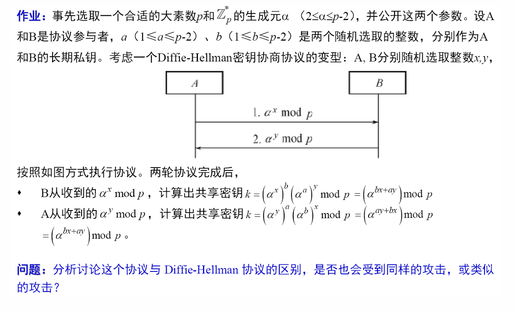

#### 第九课后作业
---

---

Diffie-Hellman协议：只使用xy。建立是临时的保密共享密钥。
变体协议：使用xy和长期密钥ab。建立的是融入了双方身份的a和b

主要区别在于将双方的长期身份信息ab融入到最终的会话密钥 K中。标准 DH 协议只协商一个临时密钥 $K = \alpha^{xy}$。

两者的安全性：

变体协议仍然容易受到中间人攻击。

1. 传统攻击：

窃听者仅获取公开的交换值 $\alpha^x$ 和 $\alpha^y$。想要计算出共享密钥 $K' = \alpha^{ay+bx} \pmod p$。安全性完全取决于a和b是否被窃听。

2. 中间人攻击

A 发送 $\alpha^x \to$ Mallory。
中间人拦截 $\alpha^x$，选取自己的会话私钥 $m_A$，并发送 $\alpha^{m_A}$ 给 B。
B 发送 $\alpha^y \to$ Mallory。
中间人拦截 $\alpha^y$，选取自己的会话私钥 $m_B$，并发送 $\alpha^{m_B}$ 给 A。

A 收到 $\alpha^{m_B}$，A 认为 B 的长期私钥是 $b$。
        $K_{AM} = (\alpha^{m_B})^a \cdot (\alpha^x)^b = \alpha^{am_B+bx} \pmod p$
B-Mallory 协商了一个密钥 $K_{BM}$：
        B 收到 $\alpha^{m_A}$，B 认为 A 的长期私钥是 $a$。
        $K_{BM} = (\alpha^{m_A})^b \cdot (\alpha^y)^a = \alpha^{bm_A+ay} \pmod p$

由于交换值 $(\alpha^x, \alpha^y)$ 不包含任何由 $a$ 或 $b$ 加密/签名的认证信息，中间人可以毫无障碍地冒充双方。

这个变体协议和标准协议一样，都会受到中间人攻击。协议的交换部分 $(\alpha^x, \alpha^y)$ 缺乏认证，导致长期私钥 $a, b$ 无法阻止 中间人冒充双方。
