## lec2 密码分析
主要是通过统计分析进行破译
##### 密码分析分为唯密文攻击，选择明文攻击，已知明文攻击，选择密文攻击
选择明文攻击是通过输入明文得到对应密文进行分析
已知明文攻击是指导部分密文-明文对进行密码分析

##### 术语：明文M，密文C，密钥K
密码空间是M,C,K,E,D的集合(后面两个是加密解密算法)、
C=E(M,K1),M=D(C,K2)

##### 密码体制分为两类：单钥密码体制和公钥密码体制
单钥密码体制：k1=k2或者可以互相推导（对称）
公钥密码体制：k1和k2无法互相推导，一般是k1公开，k2保密，所以一般加做pk和sk（非对称）

单钥体系有两大课题：怎么生成满足保密要求的密钥和怎么安全的分配密钥给对方。当然其他课题包括密钥的管理（产生，销毁）

##### Kerckhoff假设：假设敌手Oscar知道正在使用的密码体制。换言之：一个密码系统的安全性都应该基于密钥的安全性，而不是基于算法的细节的安全性。
就算敌手知道算法，但是没有密钥（即输入参数和输出参数），敌手也无法还原出明文信息。
因为密钥容易保存，容易分享，可以防止被反向工程，容易更换。

##### 信息论基础
信息量应该是概率的单调递减函数，出现概率越小，其包含信息量越大。

##### 无条件安全和计算安全
无条件安全/完善保密：无论有多少可以使用密文，都无法根据密文唯一确定明文。
必要条件是密钥的熵大于明文。H(K)>=H(M)，当然现实中很难实现。

计算安全：破译密码的代价超过密码价值，破译时间超过密码生命周期

##### 古典密码
代换：将明文中的符号一一替换成其他符号
置换：将明文中的符号位置进行打乱

Caesar密码：每个字母向后移动3位，将其扩展为k位构成密钥空间。
\(c = \text{E}(p) = (p + k) \bmod (26)\)
\(p = \text{D}(c) = (c - k) \bmod (26)\)（负数依然可用，参考模运算定义）
密钥空间是26，密钥空间很小，可以暴力破解

##### 单表代换
增强安全性：将密钥改为一个单表代换，即将26个字母随机映射到26个字母，则密钥空间大小是26！
但是自然语言具有可读性，如果预先知道采取了单表代换，那么可以统计字母的出现频率进行猜测。比如统计单字母，两个相连字母或者更多相连字母，然后进行猜测。

单表代换的缺点：明文的统计信息（语法与明文结构）全部传递给了密文，频率分析对其很适用。 

##### 多表代换
将双字母替代为另外的的双字母，变换规则按照矩阵里面分为多种规则进行替换。
密钥是一个单词，矩阵一般是5*5，所以会有元素共享一个位置。
  

#### Hill密码
将明文分成n个字母一组，转换为向量，然后乘以一个n阶矩阵，得到密文向量，然后转换为密文。
密钥是一个n阶矩阵，要求矩阵可逆（行列式与模26互质），否则无法解密。
优点：完全掩盖了明文的统计特性，已知密文无法破解
缺点：在已知明文的情况下，有可能破解（通过将几个已知明文拼成矩阵，如果明文矩阵可以求逆，那么就可以得到密钥
课程上的k是左乘列向量明文得到密文的，密文破译也是左乘，但是实际上可以采取右乘。

#### 维吉尼亚密码
使用一个字母表的多个单表代换来加密明文，密钥是一个单词，重复使用这个单词来加密明文。
\(C_i=(m_i + k_{(i \bmod r)}) \bmod 26\)
因此，每隔r的整数倍，出现单表代换
破解方法：首先得到r，然后将多表代换拆分为r个单表代换，然后对每个单表代换进行频率分析
1.猜测r,可以通过计算密文中重复出现的字符串之间的距离，然后计算这些距离的最大公约数来猜测r
2.对于每一组分别计算重合指数，如果都接近0.065，那么猜测r正确
重合指数的计算：
  
估计计算的话，把后面那个换成前面那个，构成平方就行了。

##### 一次一密
将明文与一个与明文等长的随机密钥进行逐位异或，得到密文
\(C = M \oplus K\)
密钥为随机生成，且只使用一次（服从均匀分布）
长度与明文等长，不可破译。
为完善保密。

## lec2 换位密码，第二章

##### 栅栏加密（置换技术）
##### 换位技术
将明文写成矩阵的形式，key是列次序

##### 换位密码破译
将密文写成矩阵块，然后穷举。
复杂化，对明文进行多次换位置换，但是，这相当于对于明文使用了使用了新的key的一个置换，因此，多个置换的复合仍然是一个置换。

##### 乘积密码
代换的代换还是代换，置换的置换还是置换，代换和置换的复合是更复杂的密码。
多次代换复杂性只是线性的上升，而不是量级的提升。

##### 转轮机
通过多个转轮进行加密，每个转轮是一个单表代换，转轮之间的连接关系复杂化了密码。

##### 第二章
##### 对称加密分类
对称密码分为流密码和分组密码（流密码不是课程的重点）
流密码：明文是一个一个字母进行加密，与一次一密不同的是，流密码的密钥是一个伪随机数生成器，生成的密钥流与明文进行异或
维吉尼亚，一次一密都是流密码
分组密码：将明文分成多个块进行加密，与流密码不同的是，分组密码的加密是一个块用一个k加密
可以将分组密码看成字符长度很长的代换

##### 分组密码
是一个n比特到n比特的可逆变换，本质上是一个“代换密码”，可逆变换总大小是2^n!，这是密钥空间
分组n太小，安全性不够，违背密钥空间充足准则。
n太大，代换表（key）大小就是2^n（排列个数） * n（长度），存储和管理都很困难
（密钥尺寸和密钥空间大小是两个概念）
祖冲之算法，不要求掌握
  
使用乘积密码：关键在于混淆和扩散
混淆：使密文与密钥之间的关系复杂化
扩散：使明文的统计特性分散到密文中

##### CDP和SPN
confusion dillusion paradime
SPN和CDP的区别就在于SPN会公开S盒与P盒，而CDP不会公开,spn会单独使用一个key
但是这种方法所预先处理的k长度与明文长度是一样的，因此，k的管理和分发仍然是个问题

##### 简化DES
用8位明文和10位密钥进行加密
首先将密钥通过p10置换，然后分成两部分，分别左移1位和2位，然后通过p8置换得到k1和k2（10位变8位）
两个f解密和加密是一样的
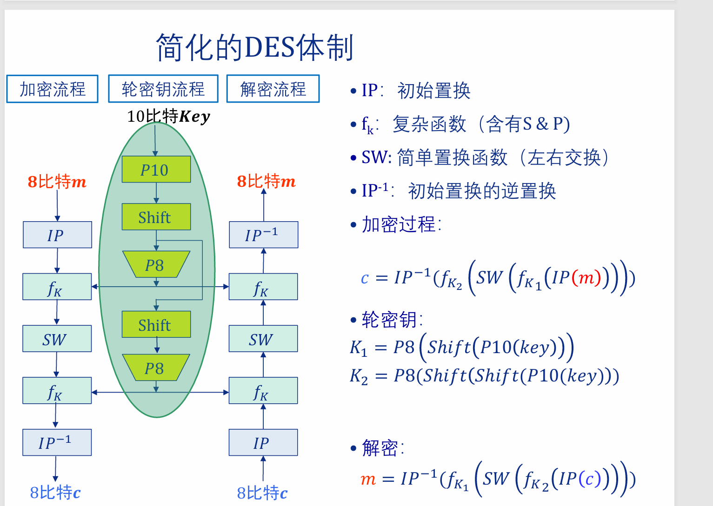
明文与k1的异或是将4位的明文部分进行扩展，将前面的4位打乱加入到后面，前面也要打乱，此时是8位，然后与k1异或
再将其分为两个部分，大小都是4位，然后通过s方法得到2位（14位比特确定4*4矩阵的行，23位比特确定列，对应的数字就是4位得到的符号）
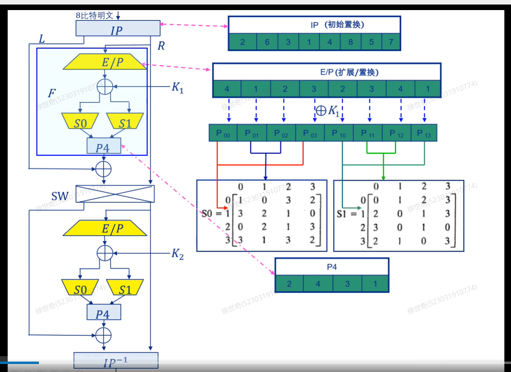
注意明文是比特数，图中的4,2这些都只是代表位置不代表内容数值，将对应空格对应的比特拼接为2两位就可以索引矩阵了
显然，sbox是一个非线性变换

整个des可以看做一轮sp输出，只改变了左边四位。

密钥只有10个比特，因此，密钥空间是2^10=1024，可以暴力破解
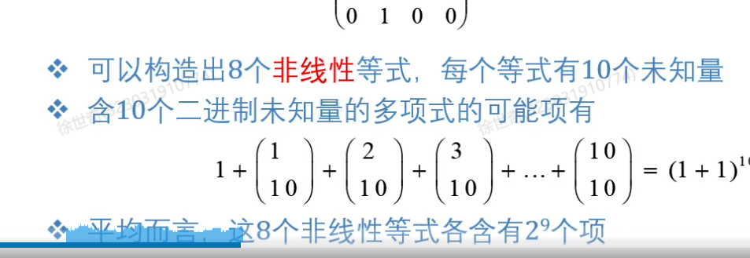
考虑已知明文攻击，8位明文密文，10位密钥，可以构造8个非线性方程组，但是有10个未知数，因此无法唯一确定密钥。
每一个方程最多含有2的十次方项（k1*k2这一类），平均来说，是2的9次方项，因此，穷举法破解大概需要2的9次方次方的计算量。

##### festel密码
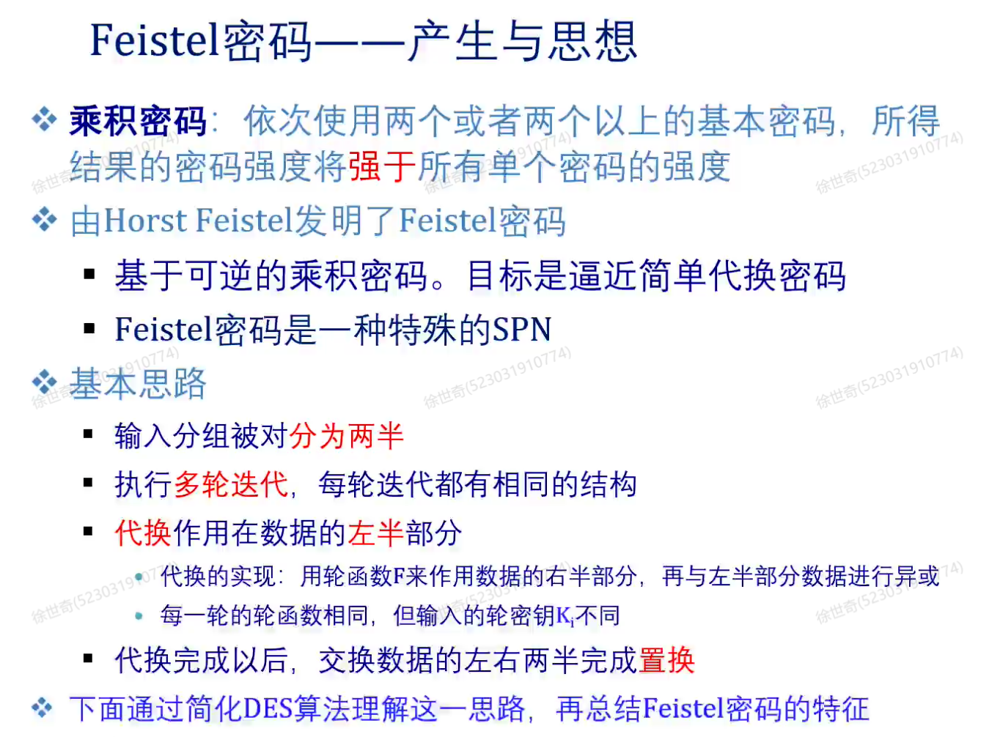
在des的基础上，扩展轮数，重复使用f函数
多轮有效增强了抗攻击性

# lec 3
##### DES密码雪崩效应
明文或者密钥的微小变化会引起密文的巨大变化
输入或者密钥的1比特变化，输出大约有一半的比特会变化
这会隐藏明文的统计特性

DES强度：
前56位为主要密钥，8位为校验位

##### 对称加密的有趣应用
洋葱加密，每一个路由只能通过本地k解密出下一个地址，而具体信息需要后面的key解读
可撤销密钥，将文件用某密钥加密，员工用自己特有密钥加密该文件密钥，将结果密钥存储在云端（此过程是第三方完成），要读取文件时，用本地密钥解密结果密钥，用得到的文件密钥解密文件。如果员工离职，那么就更换文件密钥，同时只存储未撤销员工本地的私钥所加密的结果密钥。

### 第三章

##### des是否可以多重嵌套
两重des：
首先，要满足k1和k2两次处理，不会出现攻击者用k3破解的情况，des满足。
中间相遇攻击：在已知两组明文密文对时，只需要2的56次方代价即可解密
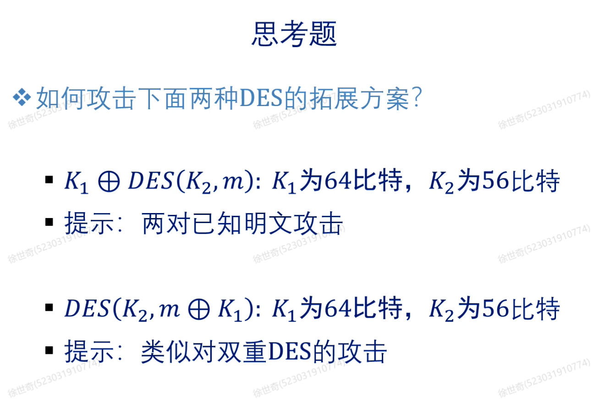
三重des：安全
传统的三重des就是简单的三重嵌套，密钥长度是168位，存储代价太大。
新型的三重des是k1=k3，采取加密-解密-加密方法，密钥长度是112位，并且可以和单重des兼容(k1=k2)
更加复杂：让三个key都不一样

但是问题在于des的s盒设计不够公开透明，可能存在后门，研究人员需要进行公开分析的新密码方法。

##### AES
四层轮函数
1.字节替换，数据块中每一个单元是一个字节，前后两个四位构成两个个16进制数，可以索引进行替换。
2.行移位，每一行循环左移0,1,2,3位
3.列混淆，每一列看成一个4维向量，然后乘以一个4*4的矩阵，矩阵是预先定义好的
4.轮密钥加，每一列与一个4维向量进行异或，这个向量是从密钥中扩展出来的
轮密钥的扩展：
密钥长度128,192,256位，分别对应10,12,14轮
首先将密钥分成4字节一组，然后每四组进行一次扩展，扩展方法是将前一组循环左移一位，然后进行字节替换，然后与一个轮常数异或，最后与前四组的第一组进行异或，得到新的第一组，然后依次类推得到后面的三组。

##### SM4（中国发布的）
feistel结构，这个部分要求不高

### 第四章
##### 电码本模式（ECB）
块密码算法（如DES，AES）直接用于加密数据块，但是只能加密固定长度的数据块，因此需要一种模式来处理任意长度的数据。
电码本模式是最简单的一种模式，将明文分成多个块，分别进行加密，不足的块进行填充
将明文分成多个块，分别进行加密
缺点：相同的明文块会被加密成相同的密文，因此在文本中频率分析仍然适用，同时在图像中，相同颜色块会被加密成相同颜色块
攻击者可以通过替换或者交换密文块进行攻击

##### CBC模式（Cipher Block Chaining）
每一个明文块在加密前与前一个密文块进行异或，第一个明文块与一个初始化向量进行异或
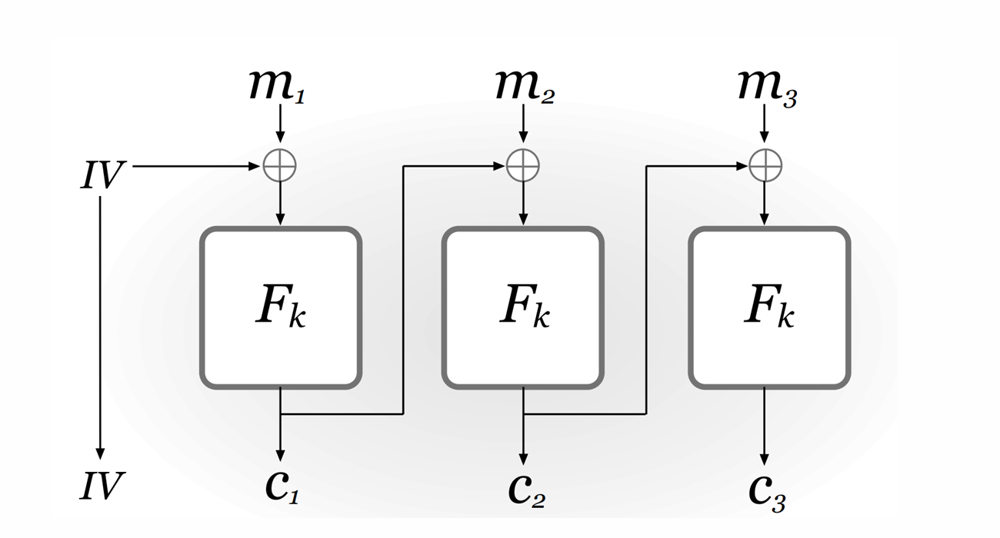
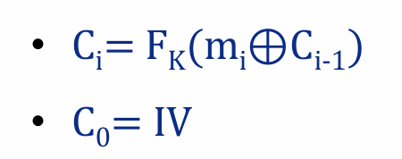
如果位数不足，用NULL填充
优点：密文组依赖前面的组，对任何一个密文组改动会影响到后面的所有组，初始向量需要随机选择
缺点：可以改动初始向量取反，从而使接受者明文部分取反。
具体攻击过程，攻击者知道密文c，可以通过发送客户端密文，是否返回error来判断padding是否正确。
padding一般是缺6位，那么就用6个06填充。
1.通过从第一个组开始随意改变密文字节，直到客户端返回error，此时可以判断出密文最后几位对应的是哪个值（因为最后几位作为填充是相同的值，但是对应的密文是不一样的，因为是链接加密），假设是06
2.通过更改密文，可以构造后面几位为07（这个很简单，因为VI每一位取反，那么结果解密就会取反），所以第一步里面得到的6位是可以轻易更改为07.
3.攻击者知道了后面6位填充位的值，现在要破解前面2位是什么信息，通过遍历第二位密文的所有可能，直到客户端返回success，则知道了现在的密文是对应07，就可以按照异或推出明文第二位实际的值，同理可以得到第一位的值。
此时就可以破解出明文信息，破解一位需要256次尝试。

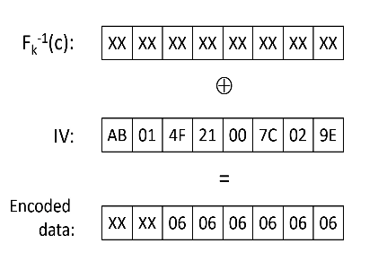

##### OFB模式（Output Feedback）
是对初始向量进行多次加密，然后与明文进行异或，所以结果不依赖前一个密文块
优点：可以预先计算密钥流，适合实时加密，无需等待停顿
缺点：类似于一次一密，所以绝对不能重复使用初始向量，否则会被破解
对抗篡改能力不如CBC，对明文取反，密文对应位取反（因为密文是明文与密钥流异或）
发送方与接收方同步发送接收。

##### CTR模式（Counter）
将初始向量与一个计数器进行拼接，然后进行加密，得到密钥流，然后与明文进行异或
优点：可以并行处理，适合高吞吐量场景
缺点：计数器不能重复使用，否则会被破解，还是类似于一次一密

##### 随机数生成

### 第五章，对称保密技术
OTP：一次一密是安全的，但是密钥空间太大显然不太可能实际应用。
因此使用种子密钥，构造流密码，用小空间映射大空间，

对称加密的不可区分安全性：攻击者发送两个明文，挑战者用一个密钥随机选择一个明文加密返回密文，攻击者如果认为密文对应的两个明文概率几乎一致，那么攻击不可能成功
只要攻击者无法区分产生的随机数是不是真随机数，那么就是一个安全的PRG算法，这就是不可区分。
计算安全性：ppt攻击者，有限算法，成功概率即可。all-power攻击者，无限算力和时间，攻击率成功必须是0，完善加密。

窃听攻击模型，明文空间最少是2，假设攻击者能力最大化，锁定明文在两个之间，如果根据密文推导的一个明文概率不等于50%，那么就称之为成功，这是完善保密，但是我们一般采用偏离50%是不可忽略的才称之为成功。

##### 伪随机数生成器与伪随机函数
生成器：种子扩展为长的比特串
对于ppt区分器，对于均匀选择的key，区分器区分真随机函数和密钥函数的概率可忽略，那么其就是伪随机函数。
区分器显然不能知道k，否则根据密文之间反向确定明文，对于伪随机概率为100%，但是真随机为$2^{n*2^n}$,所以几乎可以完全区分
伪随机函数当且仅当PRG存在
分组加密。
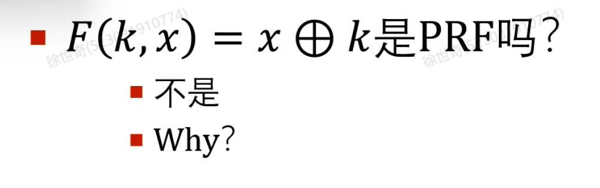
这个例子就不是PRF，因为当我输入两个不同x，伪随机会用一个k加密得到两个y，那么我将两个f异或如果等于两个x异或那么就是伪随机。
如果是真随机，那么两个x异或并不一定等于f异或，所以区分器可以轻易区分开来。

##### 伪随机置换
CBC不复用IV，就可以保证同样m的输入，但是输出不同，可以逼近随机函数。
其他就看ppt

##### 密钥分配方式
1.密钥分级：由KDC负责分配密钥，对于每一个用户，用独有的一个key来封存。
信息传递，两个人想要通信，通过KDC用两个key封存内容
- KDC采取中间人策略，通过用户来传递信息，按照从后到前的顺讯，用对应k洋葱化包裹内容，每一层附加内容ks。
但是很明显有问题，攻击者伪造成用户，在发送方伪装为接收者，在接收者伪装为发送者，从而窃听。
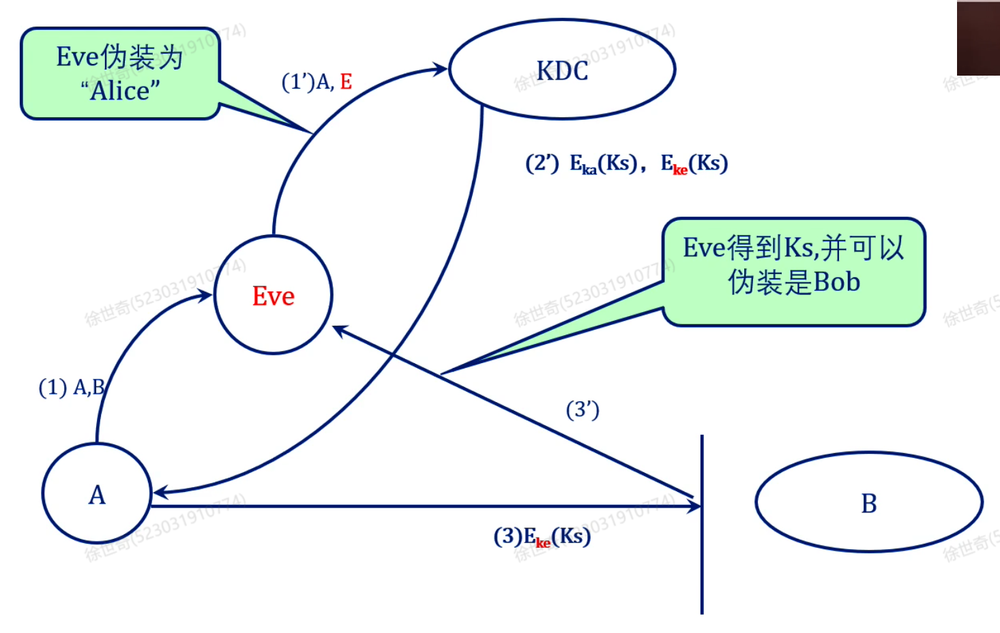
- 在原来基础上，A需要额外传一个request，然后检测KDC有无返回request。
攻击者可以假装自己是KDC发送旧信息给A，让B得到旧信息，因为k没有变，并且没有检查时间戳的功能，所以可以攻击。
- 在2基础上，加上时间戳
中间人直接不管，对B发昨天的信息，这是没有对A的实体验证，旧消息可以是B和任何人通信的内容，因为时间戳是KDC和A之间的通信
- 加上A的ID认证
A对B的旧信息内容攻击。
- 最终密钥分配协议
B增加一个用ks加密的N2给A，A解密回传f(N2)，用来验证消息的新鲜性。

##### 密钥的生命周期
用控制向量控制主密钥，可以随时更改，长度任意，因为hash函数input无限制

### 第六章，消息加密和认证技术
认证：实体认证和消息认证
需要认证符(冗余内容)来验证发送方和消息，用密钥源参与生成
报文加密，mac报文认证码，hash函数
对称加密做认证不可行
哈希函数做认证码，哈希函数是一个大空间映射到小空间中的函数，所以可能会出现两个message(内容和tag)m1,m2对应的哈希值一样,因此将m1tag截取给m2，可以实现篡改信息。
散列函数特点：单向性(H(x)=h,通过h找x不可行)，弱抗碰撞性(已知一个x，找哈希值一样的y)，强抗碰撞性(找两个不同x，y的哈希值一致计算不可行)

##### 杂凑函数(企图构造一个hash函数)
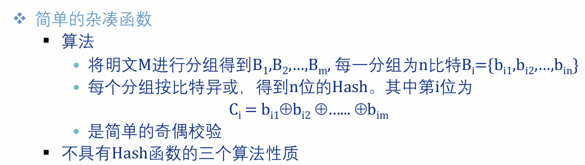
ppt有点问题，是每个分组的第一个比特异或，得到hash的第一个值。
单向性很容易办到，随便来m-1个m，和c异或就得到完整的x了。剩下两个碰撞性只需要在原来的基础上异或上两个一样的x就可以了。
不行
##### MD
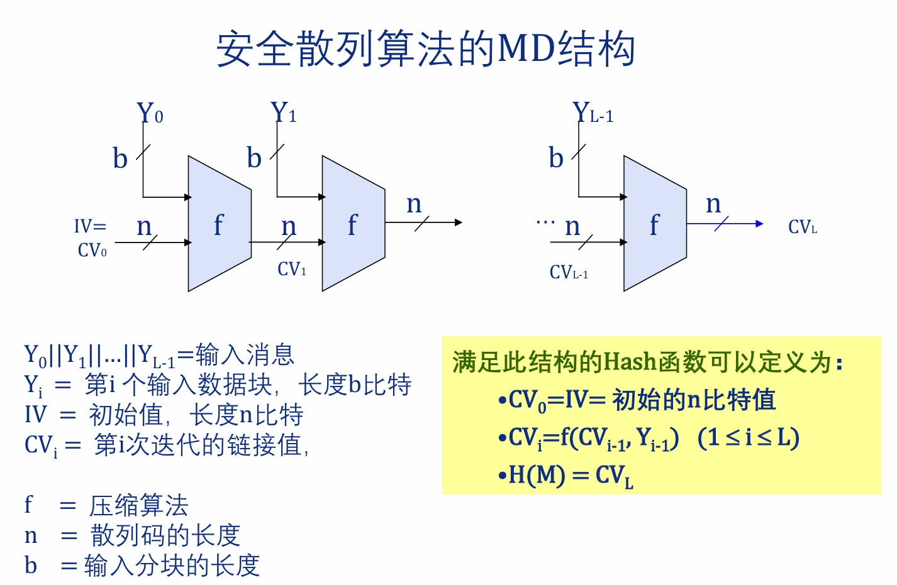
##### 生日攻击
至少多少个人，生日相同概率大于50%？
攻击，强碰撞性相对弱碰撞性更容易。
##### MD5
将原始数据分组，然后填充满足m的整数倍，将数据分组为512bit大小为一个组，将其分为4个部分，分别按照先后处理。
##### SHA-1
##### 消息认证码(mac)
早起的mac算法DAC，使用了DES的方式，类似于加密，但是问题在于我可以构造另一个不同的x，但是他们mac相同。
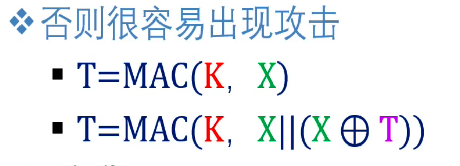
具体的推导很简单，因为他把T当做IV了，相当于最后一步还是在算E(x，T)=mac
改进的方法就是使用三个密钥，具体见ppt
##### HMAC
单纯的hash函数不能做mac
使用双重嵌套，让mac不能作为下一次的输入，因为攻击者不知道k，所以无法得到hash包裹的第一个部分：
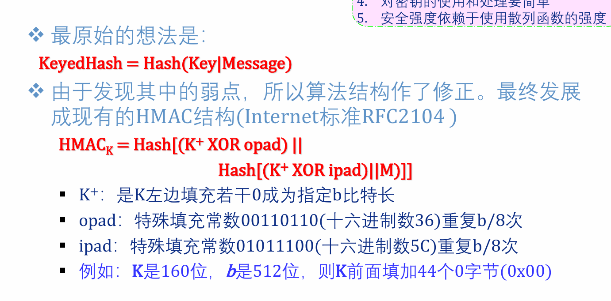

### 第七章：公钥密码算法
素数是无限的，随着素数越来越大，会越来越分布稀疏
一个数论的结论：两个数的最大公因子可以通过他们两个的线性方程来表示出来。
###### 整数的Euclid算法（辗转相除法）
中间的每一个余数可以被a，b表示(结论)，即最大公因子可以被a，b线性表示。
当a，b互素，即最大公因子为1，则可以表示为ax+by=1.可以用递归方法求解x和y，参照ppt。
证明：当a和m互素的时候，ax+b=m有唯一解。
互素则ax+my=1有xy解，则ax=1modm
则x‘=x*-b，x是上面这个x，x’就是我们要求的解，就是一个1*-b。
###### 整数的唯一因子分解
整数可以被分解为素数的乘积，如果不计素数次序，则只有一个方法分解正整数(结论)
pj次方整数只能被pi次方整数整除。
应用：a|b的话，a素因子一定被b包括，并且幂次不大于b。
###### 整数同余
a=bmodm
加法乘法封闭，同时如果a=bmodm,c=dmodm,则ac=bdmodm
等价类与剩余系：非负最小完全剩余系：0,1，......,m-1.完全剩余系就是m个数就ok，有多种取法。
如果m和k互素，则完全剩余系每个元素乘以k，也是m完全剩余系。
证明：只需证明乘以k后的集合元素不变即可。
如果i不等于j，但是kai=kajmodm
因为km互素，参考前面的Euclid证明，kx=1modm一定有整数解，因此支持乘以逆元的操作，即ai=ajmodm，矛盾，因此是m个元素，是完全剩余系。

简化剩余系：在m完全剩余系中只保留m互素的数。
Euler函数：简化剩余系的元素个数。不超过m并且与m互素的数的个数。(两个等价定义)
###### Euler定理：如果an互素，则a的φn次方=1modn，an为任意正整数
证明方法：
1.zn为简化系，azn数量和zn一致
2.azn里面的没一个元素都是zn里面的元素。这个是因为a与n互素，x与n互素(x< n)所以运算法则，ax和n互素，因此保证ax都是n的素数。
3.证明πxi=πaximodm，共φn个数相乘，提取出常数a，然后消去πxi。为什么可以除？其实这里没有除，因为没办法除以0，而是乘以逆元，因为xi和n互素，所以支持逆元操作，上述是以每个xi单独乘以自己的逆元来消去的。是定义了逆元，通过乘法来消元，这就没问题了。用用结合律和运算规律就可以知道了。乘法封闭。
Euler定理等价形式，当n=pq，pq均为素数，则：
a的φpq+1次方=aφ(p-1)(q-1)+1次方=amodn，即使na不互素，也成立。
这个证明需要分几种情况，讨论a整除p或者q，或者a和n互素，看ppt即可。
一些方法：如果p是素数，则φp=p-1，φpk次方=p的k-1次方*(p-1)这是所有的pk次方个数减去1*p......pk-1次方乘以p共pk-1次方个数得来的。
引理：m1m2为正整数并且互素，A和B是两个分别的简化剩余系，则m1A+m2B是mod m1m2的简化剩余系。(不考证明)分解条件必须是两个m互素
这个引理表示的结论是如果m1和m2互素，则φm1*φm2=|m1*m2|
比如φ21=φ3*φ7
推广：
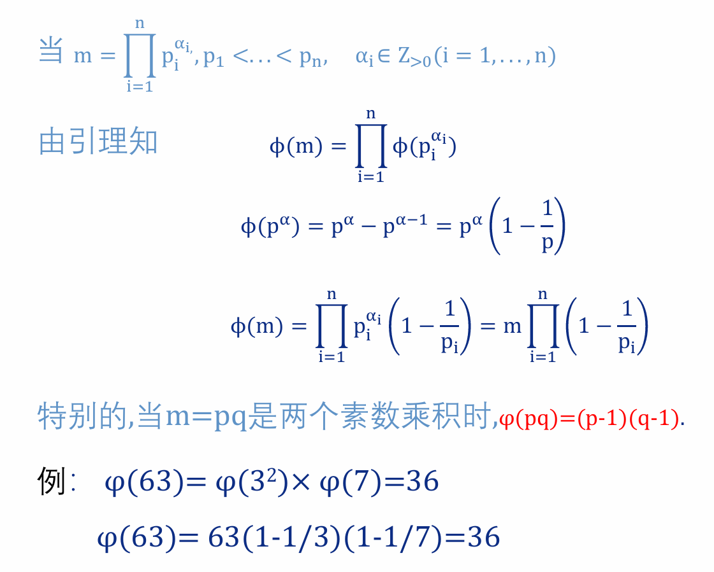
###### Fermat小定理
就是把n换成素数p
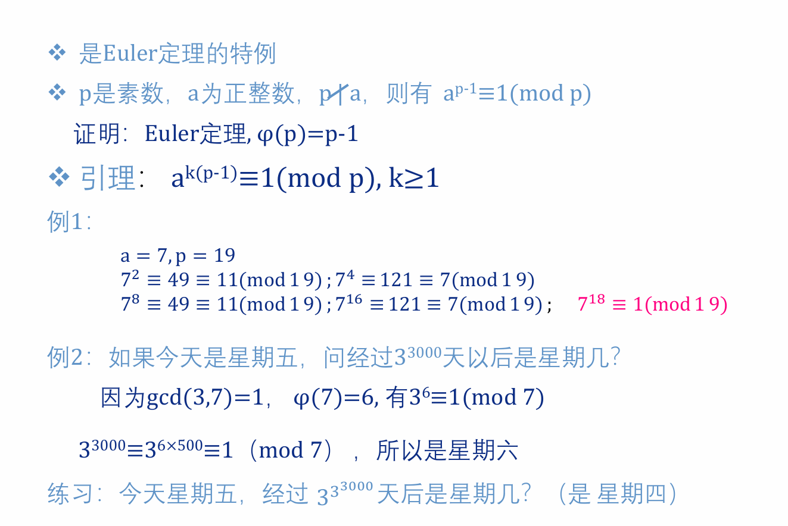
###### 素数测试：判断大整数是不是素数
使用概率算法，但是这个问题是确定性的问题。
使用miller-rabin算法(没有讲解，需要数论知识)
###### 中国剩余定理
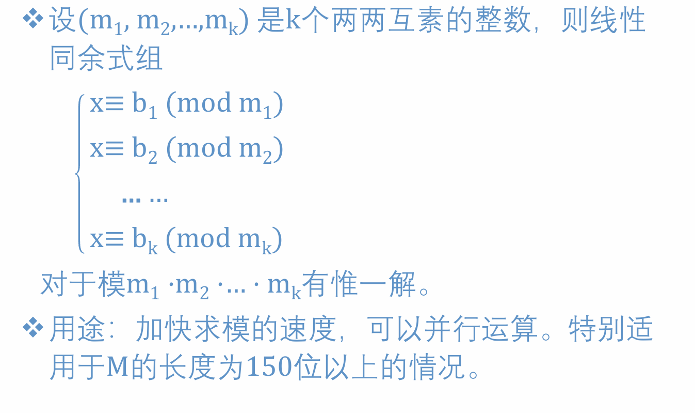

###### 次数与原根
由于a和n互素，则存在k，使得ak次方=1modn，最小的k称为a模n的次数。
k一定整除φm但是不一定相等。
例如所有奇数模8的次数都是2，因为所有奇数的平方都是1mod8。
原根：如果a的次数等于φn，则称a为n的一个原根。
如果n有原根，则n只能是2，4，pk，2pk的形式，原根个数是φ(φ(n))
原根可以生成简化剩余系。
###### 离散对数问题
y=gx次方modp，已知g,p,y，求x
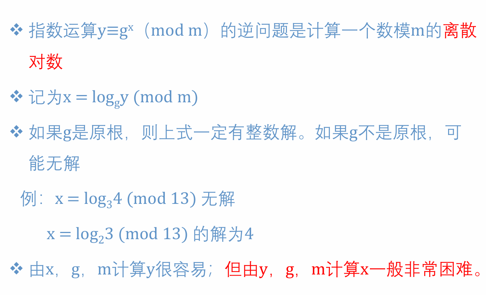
可以暴力全部遍历，也可以在根号p的量级下搞。
###### Merkle puzzle
通过构造大量的谜题，让通信双方选择一个谜题进行解答，从而得到一个共享密钥，但是算法不高效。
公钥算法：A公开公钥，B用其加密，A用私钥解密。

单向函数：
离散对数问题
陷门单向函数：δ可以让单向函数的反向计算容易
第一批公钥密码算法：
1.背包问题，超递增背包容易，是在特定情况下很难，但是平均意义下并不是很难
###### RSA算法
2.RSA主要是基于大整数分解
这里是因为e和n互素所以才有逆元这个概念。使用素性测试算法找素数。
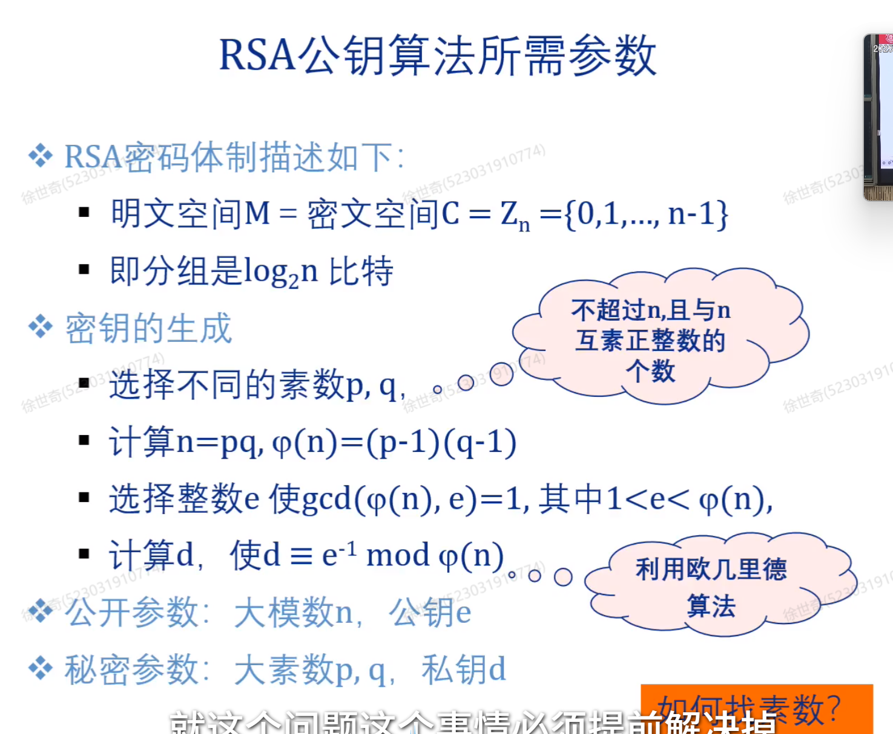
RSA加解密：
正确性：对于M用e和d加解密，因为n是两个素数乘积，因此不需要去看M是否和n互素，这个是欧拉扩展定理。所以M的φn次方+1次方=Mmodn
并且想要n和m不互素概率很低，因为512位数的情况下很难触发。
安全性：主要是通过大整数分解为素数很难来保证的，一旦攻击者知道分解方法和两个素数，那么就可以得到n的欧拉数，然后就可以参考合成数的欧拉数求出d。
在实际中RSA参数选择，p和q尽可能相差大，pq为强素数，即p=2p1+1，可以用另一个素数倍数加一合成。

###### RSA攻击
1.数学攻击：如果pq太近，ppt构造的式子里面另一个就稍微大于根号n，那么只要从根号n开始找x，x平方-n等于一个平方数，那么x-y和x+y就是p和q
2. 共模攻击：见ppt，如果两个用户公钥互素，可以拼接得到密文，见ppt。要共用n
3. 小e攻击 假设e很小，用户共用e，但是n不同。这几个n一定互素(定义和实际情况)，那么可以通过中国剩余定理得到一个大数，然后开e次方即可。可以开方的原因是模数大于m次方，所以模操作失效，不是同余而是严格等于。
4. 计时攻击：略。
n必须大于m，这可以防止信息的丢失，并且还能防止两个不同的明文映射到同一个密文(一个大于n，一个小于n)等等其他原因。
###### RSA-OAEP
看ppt

### 第八章
基于离散对数构造的公钥加密
###### diffie-hellman密钥协商
公开大素数p作为模，和模p的原根g，各自生成自己的私钥x1x2，看ppt。
这是一个陷门单向函数，在知道a或者b的情况下很容易由g的两种幂次得到g的a*b次方
安全性：攻击者需要得到xa或者xb才能得到共享密钥，就是解决离散对数问题，知道g的xa次方和g的xb次方，不需要单独求出a和b，只需求g的ab次方很难。
攻击：中间人攻击，截取g的a次方，换成中间人的g的m次方，接受方同理，这样就可以和双方通信，但是两个人的信息不通，这是因为没有认证。
###### ElGamal加密
可以直接除法的原因是和p互素。
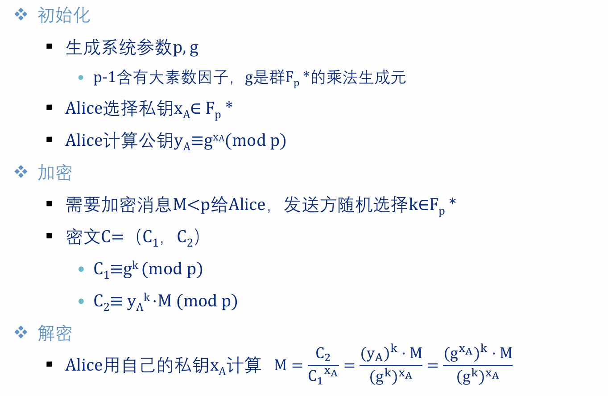
公钥加密安全模型，在选择明文攻击CPA下是安全的，用攻击者给的两个明文，challenger给他一个密文，让他猜是哪一个，Elgammal是安全的，但是传统方法不行，因为攻击者知道公钥，他自己就可以加密，只需要在2的空间上尝试加密比较密文就可以了。RSA不安全。
但是在选择密文攻击CCA时，此时攻击者能力升级，可以通过oracle得到除了自己两个密文之外其他密文的对应明文，RSA是安全的，ELgammal不安全。
手动构造一个和密文c相似的密文，比如在g的指数上加m，对c1c2做同样处理，然后通过oracle返回的明文直接算出来密文对应的明文，两个相除就得到明文了，用简单的乘除法可以解密明文。
这里的ElGamal加密是textbook版本的
就是说系统参数是p和g，接受方有私钥xa，构造的g的xa次方公钥，发送者随机选择k，发送给接受者两个c，然后接受者用自己的私钥xa解密出密文，由于M所乘以的是一个随机数（因为k随机，所以g的xak次方随机），相当于one-time，可以完全掩盖m信息。由于不同发送者k不同，所以同一个明文有很多密文。
实际中的ElGamal加密可以抵御攻击

###### 椭圆曲线密码学
公钥密码体系参数太长
两个曲线上的点直线，交予曲线另一个点，关于x轴对称得到群的加法结果。
点和他关于x轴的对称运算交于无限远点。注意，形状不是椭圆，只是方程类似
这个群的运算封闭
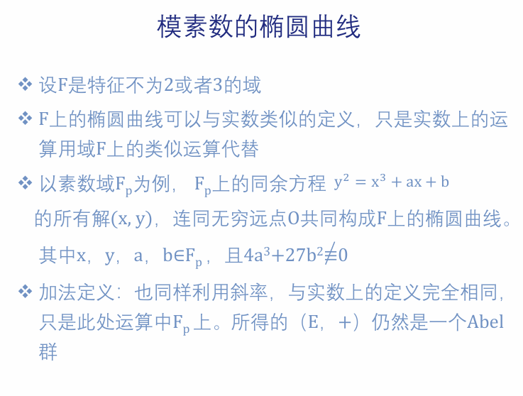具体计算见ppt
ppt里面是模23，所以-10和23等价，同时点和他的逆相加就是无穷远点。2的逆元（即2分之1）的逆元是12，可以变除法为乘法。
反正就是先求λ再求x和y，套公式即可
传过来一个x，会对应正负的两个y
椭圆曲线的离散对数问题的困难问题：np=q，指的是n个p运算，给你p和q来算n，这是个困难问题。
双方分别持有ap和bp，交换后处理得到abp，和dh算法一样其实。使用ElGamal加密，则需要把m进行编码，因为一般都是点的操作

###### SM2加密算法
点的运算可以用幂次来代替加法，意思是一样的
加密m时，是将其从点编码成数的形式。c1和c2就能求出明文，c3应该是用来检查差错错误的，c3的hash保证了调整c1和c2无法通过解密验证，先解密再验证，保证攻击者如果不知道m，无法hash出结果即加入了解密验证。

### 第九章
###### 认证协议
在公开的信道下如何进行对于双方的认证（之前的对称密码采用的hash之类的手段）
电子签名必须绑定到文件上，任何人都可以用公开验证算法来验证签名，签名是为了避免双方的互相欺骗，两个问题：b可以伪造签名来自a，a也可以否认自己的签名。
数字签名：不能伪造，不能否认，不能伪造消息传送的过程
伪造数字签名在计算复杂度上有两个不可行：对旧签名伪造新消息，为旧消息伪造新签名
同时hash必须要抗碰撞，否则攻击者可以伪造两个m他们对应的hash值一样，这样就可以实现第一个不可行，比如这里的hash处理（为了把m映射到固定长度的hash函数）
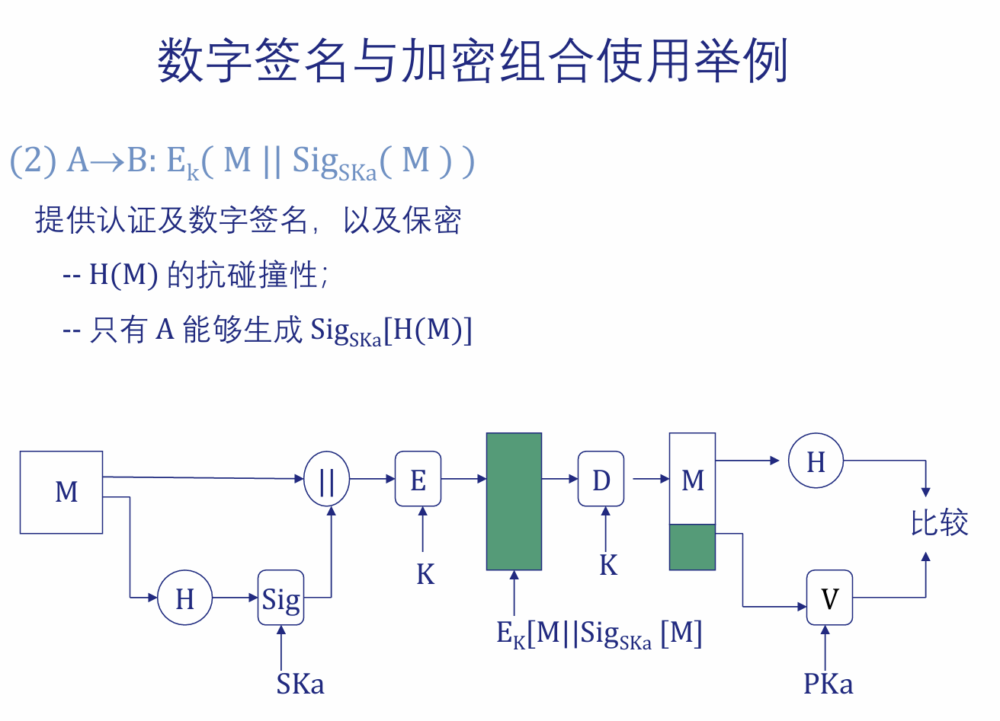

###### RSA 签名攻击
签名验证就是解密，签名为明文的私钥次方，此时用公钥解密，看得到签名的解密是否等于明文就可以知道是否验证成功，注意，这里的明文公开，我们只关注认证性。
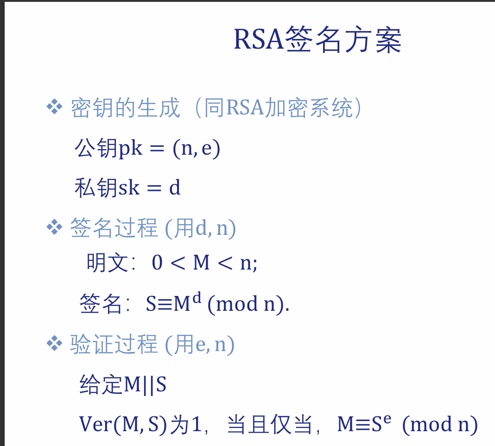
1.构造信息和签名 （m的e次方，m）分别表示密文和签名（注意，这里是攻击者随便选择的m）来发送出去，能够被验证正确，但是由于m的e次方往往没有意义，所以没有什么威胁
2. 构造平方（m的平方，s的平方），攻击者制造有意义的m的平方信息，然后开方，将m给对方，得到s，然后将其s平方，所构造的能够通过验证。
3. 通过在m后面乘一个数，得到签名然后消去那个数。
4. 通过签名破译密文，攻击者构造消息，m的e次方发送给签名者，签名信息就是解码m，得到明文。
5. 分组签名非常麻烦
即这个签名方法即不安全也不实用。
解决方法，m先进行hash到n个比特，然后再d次方作为签名
由于hash映射的值是256位太短了，所以要把他先预先填充到一个大小。
如果不是固定长度，攻击者用两组密文签名对，就可以伪造新的组合m1*m2=m3.
工程算法中是跳过所有f，但是没有数多少个f，因此攻击者就可以构造D，让其长度变小，后面填充新的值。
纠正方法就是确认D的右侧没有其他的比特。

###### DSS 数字签名
使用了DSA算法和hash函数
具体见ppt，那个等式是在一个等式基础上，下面同时加上有一个g的次方
引入了随机数k，k不能被暴露，否则会暴露用户私钥x。如果两个签名使用同一个k，那么可以构造二元一次方程来解出私钥。

###### 公钥问题
如何确定这个公钥是属于某个人的公钥而不是谎称。
比如中间人攻击。
解决方法：公共目录，问题在于管理员的私钥被攻击者攻破那就完蛋。
公钥授权。问题在于容易被dos攻击，让公钥管理机构没有带宽和其他人进行通信。
公钥证书。给签名

### 认证服务
身份认证协议：
- 口令协议，用户发送口令，服务器对口令秘钥做H哈希处理，验证是否和预存值一样。注意，必须哈希处理，因为服务器可能被攻破
增加字典攻击的难度：使用公开盐和秘密盐。
公开盐的salt服务器会记录，这个会参与hash的构成，因为攻击者只能猜测用户id和习惯，但是salt是随机的，必须穷举。
秘密盐中的pepper是随机的，服务器也不知道，他也需要穷举，同时对于攻击者他需要多穷举一层pepper，计算量增长的更多。
- 一次口令协议。就是口令只能使用一次。
- 挑战响应协议：