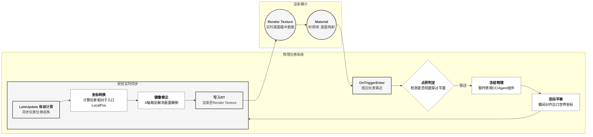

```mermaid
graph LR
    %% 全局样式定义
    classDef grayStyle fill:#f5f5f5,stroke:#333,stroke-width:2px,color:#333;
    classDef componentStyle fill:#ffffff,stroke:#666,stroke-width:1px,color:#000;

    %% 模块一：视觉同步
    subgraph M1 ["视觉实时同步"]
        direction LR
        A1[<b>LateUpdate 每帧计算</b><br/>同步玩家位移视角]:::grayStyle --> B1[<b>坐标转换</b><br/>计算玩家相对于入口LocalPos]:::componentStyle
        B1 --> C1[<b>镜像修正</b><br/>X轴取反解决画面颠倒]:::componentStyle
        C1 --> D1[<b>写入RT</b><br/>渲染至Render Texture]:::grayStyle
    end

    %% 模块二：中间媒介
    subgraph M2 ["渲染媒介"]
        direction LR
        G1((<b>Render Texture</b><br/>实时画面缓冲数据)):::grayStyle --> H1((<b>Material</b><br/>材质球: 画面映射)):::grayStyle
    end

    %% 模块三：物理位移
    subgraph M3 ["物理位移系统"]
        direction LR
        I1[<b>OnTriggerEnter</b><br/>感应玩家靠近]:::grayStyle --> J1{<b>点积判定</b><br/>检测是否彻底穿过平面}:::componentStyle
        J1 -- 穿过 --> K1[<b>冻结物理</b><br/>暂时禁用CC/Agent组件]:::componentStyle
        K1 --> L1[<b>空间平移</b><br/>瞬间对齐出口世界坐标]:::componentStyle
        L1 --> M1[<b>恢复激活</b><br/>设置冷却并开启物理]:::grayStyle
    end

    %% 连接逻辑流向
    D1 --> G1
    H1 --> I1

    %% 样式应用
    class A1,D1,G1,H1,I1,M1 grayStyle;
```